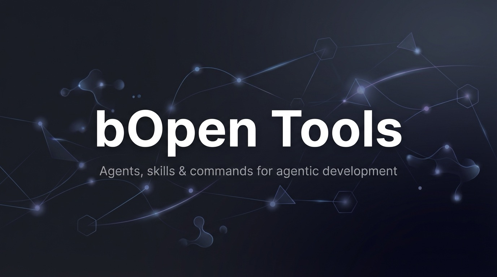

<p align="center">
  
</p>

# OPL Prompts & AI Agents

**Supercharge Claude Code with specialized AI agents and prompts** for BSV blockchain development, project automation, and workflow optimization.

## What This Repository Does

This repository provides:
- **Specialized AI Agents** - Expert sub-agents for specific tasks (design, security, documentation, content, payments, auth, etc.)
- **Slash Commands** - Instant automation tools for common workflows
- **Automation Hooks** - Background workflows to enhance development
- **Powerful Prompts** - Reusable templates for complex operations

## Installation

**Full Plugin** (recommended - includes 18 agents, 10 hooks, commands):
```bash
/plugin install bopen-tools@b-open-io
```

**Skills Only** (for other agentic frameworks):
```bash
bunx skills add b-open-io/bopen-tools --skill x-research
bunx skills add b-open-io/bopen-tools --skill x-tweet-fetch
bunx skills add b-open-io/bopen-tools --skill x-tweet-search
bunx skills add b-open-io/bopen-tools --skill x-user-lookup
bunx skills add b-open-io/bopen-tools --skill x-user-timeline
bunx skills add b-open-io/bopen-tools --skill frontend-design
bunx skills add b-open-io/bopen-tools --skill ui-audio-theme
bunx skills add b-open-io/bopen-tools --skill cli-demo-gif
bunx skills add b-open-io/bopen-tools --skill deck-creator
bunx skills add b-open-io/bopen-tools --skill humanize
bunx skills add b-open-io/bopen-tools --skill npm-publish
bunx skills add b-open-io/bopen-tools --skill notebooklm
bunx skills add b-open-io/bopen-tools --skill payload
bunx skills add b-open-io/bopen-tools --skill plaid-integration
bunx skills add b-open-io/bopen-tools --skill reinforce-skills
bunx skills add b-open-io/bopen-tools --skill saas-launch-audit
bunx skills add b-open-io/bopen-tools --skill statusline-setup
bunx skills add b-open-io/bopen-tools --skill workflow-orchestration
bunx skills add b-open-io/bopen-tools --skill confess
bunx skills add b-open-io/bopen-tools --skill critique
bunx skills add b-open-io/bopen-tools --skill geo-optimizer
bunx skills add b-open-io/bopen-tools --skill frontend-performance
```

## Specialized AI Agents

Our 22 expert agents enhance Claude Code with specialized knowledge. See [agents/](agents/) for full details.

### Development & Architecture
- 🔵 [**prompt-engineer**](agents/prompt-engineer.md) — Zack — Slash commands, agent skills, YAML frontmatter, Claude Code config
- 🏗️ [**architecture-reviewer**](agents/architecture-reviewer.md) — Kayle — Large-scale system design, refactoring, multi-file analysis
- 🔴 [**code-auditor**](agents/code-auditor.md) — Nyx — Security vulnerabilities, comprehensive code audits
- 🚀 [**optimizer**](agents/optimizer.md) — Torque — Runtime performance, bundle analysis, Core Web Vitals
- 🧪 [**tester**](agents/tester.md) — Iris — Testing strategies, evals, skill benchmarking, CI automation
- 🧹 [**consolidator**](agents/consolidator.md) — Steve — File organization, deduplication, naming conventions

### Platform & Infrastructure
- 🟠 [**devops**](agents/devops.md) — Zoro — Vercel + Railway + Bun stack, CI/CD, security scanning
- 🟢 [**database**](agents/database.md) — Idris — PostgreSQL, MySQL, MongoDB, Redis, SQLite, Turso, Convex
- 📱 [**mobile**](agents/mobile.md) — Kira — React Native, Swift, Kotlin, Flutter
- 🔗 [**integration-expert**](agents/integration-expert.md) — Maxim — API integrations, webhooks, third-party services
- 🟠 [**mcp**](agents/mcp.md) — Orbit — MCP server setup, diagnostics, PostgreSQL/Redis/GitHub MCP
- ⚡ [**nextjs**](agents/nextjs.md) — Nori — Next.js, React 19, Turbopack, Bun, Biome

### Specialized Domains
- 💚 [**payments**](agents/payments.md) — Mina — Payment integrations, Plaid, financial operations
- 🤖 [**agent-builder**](agents/agent-builder.md) — Rowan — AI agent systems, tool-calling, multi-agent orchestration
- 📊 [**data**](agents/data.md) — Mr. Data Accumulator — Data processing, analytics, ETL pipelines
- ⚖️ [**legal**](agents/legal.md) — Helena — Legal compliance, privacy regulations, terms of service
- 📣 [**marketer**](agents/marketer.md) — Caal — CRO, copywriting, SEO, launch strategy, email sequences
- 🗂️ [**project-manager**](agents/project-manager.md) — Sage — Linear planning, issue tracking, project organization

### Content & Communication
- 🟣 [**designer**](agents/designer.md) — Mira — UI/UX, Tailwind, shadcn/ui, accessibility, dark mode
- 🔷 [**documentation-writer**](agents/documentation-writer.md) — Flow — READMEs, API docs, PRDs, guides
- 🎵 [**audio-specialist**](agents/audio-specialist.md) — Juniper — ElevenLabs audio, sound effects, music generation
- 🩷 [**researcher**](agents/researcher.md) — Parker — Web research, docs, APIs, parallel research strategies

**Usage:** `"Use the [agent-name] to [specific task]"`

## Skills

Skills are context-triggered capabilities. They activate automatically or can be invoked directly.

### X/Twitter
- **x-research** - Research X/Twitter trends and sentiment via xAI Grok (requires `XAI_API_KEY`)
  ```bash
  bunx skills add b-open-io/bopen-tools --skill x-research
  ```
- **x-tweet-fetch** - Fetch individual tweets by ID via X API v2
  ```bash
  bunx skills add b-open-io/bopen-tools --skill x-tweet-fetch
  ```
- **x-tweet-search** - Search X/Twitter for tweets via X API v2
  ```bash
  bunx skills add b-open-io/bopen-tools --skill x-tweet-search
  ```
- **x-user-lookup** - Look up X/Twitter user profiles via X API v2
  ```bash
  bunx skills add b-open-io/bopen-tools --skill x-user-lookup
  ```
- **x-user-timeline** - Fetch user timelines and recent tweets via X API v2
  ```bash
  bunx skills add b-open-io/bopen-tools --skill x-user-timeline
  ```

### Content & Media
- **frontend-design** - Bold UI designs that avoid generic AI aesthetics
  ```bash
  bunx skills add b-open-io/bopen-tools --skill frontend-design
  ```
- **prd-creator** - Create comprehensive PRDs with Shape Up + Working Backwards methodology
  ```bash
  bunx skills add b-open-io/bopen-tools --skill prd-creator
  ```
- **ui-audio-theme** - Generate cohesive UI sound effects
  ```bash
  bunx skills add b-open-io/bopen-tools --skill ui-audio-theme
  ```
- **cli-demo-gif** - Create terminal demo GIFs for documentation
  ```bash
  bunx skills add b-open-io/bopen-tools --skill cli-demo-gif
  ```
  ```bash
  ```
- **deck-creator** - Create presentation decks and slide content
  ```bash
  bunx skills add b-open-io/bopen-tools --skill deck-creator
  ```
- **humanize** - Remove AI writing patterns and restore natural voice
  ```bash
  bunx skills add b-open-io/bopen-tools --skill humanize
  ```

### Development
- **benchmark-skills** - Write evals for skills and measure their impact vs baseline
  ```bash
  bunx skills add b-open-io/bopen-tools --skill benchmark-skills
  ```
- **npm-publish** - Publish packages with changelog and version management
  ```bash
  bunx skills add b-open-io/bopen-tools --skill npm-publish
  ```
- **notebooklm** - Query Google NotebookLM for source-grounded answers
  ```bash
  bunx skills add b-open-io/bopen-tools --skill notebooklm
  ```
- **frontend-performance** - Optimize frontend performance and loading speed
  ```bash
  bunx skills add b-open-io/bopen-tools --skill frontend-performance
  ```
- **confess** - Analyze and document code issues and technical debt
  ```bash
  bunx skills add b-open-io/bopen-tools --skill confess
  ```
- **critique** - Review and provide constructive feedback on code and design
  ```bash
  bunx skills add b-open-io/bopen-tools --skill critique
  ```
- **reinforce-skills** - Strengthen and reinforce installed skill behaviors
  ```bash
  bunx skills add b-open-io/bopen-tools --skill reinforce-skills
  ```
- **statusline-setup** - Configure custom statusline for Claude Code
  ```bash
  bunx skills add b-open-io/bopen-tools --skill statusline-setup
  ```

### Integrations
- **plaid-integration** - Banking data via Plaid API
  ```bash
  bunx skills add b-open-io/bopen-tools --skill plaid-integration
  ```
### Operations
- **geo-optimizer** - Geographic and location-based optimizations
  ```bash
  bunx skills add b-open-io/bopen-tools --skill geo-optimizer
  ```
- **saas-launch-audit** - Audit SaaS applications for launch readiness
  ```bash
  bunx skills add b-open-io/bopen-tools --skill saas-launch-audit
  ```
- **workflow-orchestration** - Orchestrate and automate complex workflows
  ```bash
  bunx skills add b-open-io/bopen-tools --skill workflow-orchestration
  ```

## Slash Commands

Commands use category subdirectories: `/category:command` or `/command` for root-level commands.

- `/bug-hunt` - Adversarial bug hunt with 3 isolated agents (hunter, skeptic, referee)
- `/docs:prd` - Create comprehensive PRDs with Shape Up + Working Backwards methodology
- `/utils:context` - Generate repo context snapshot for agents

## Automation Hooks

Hooks are opt-in automation that runs in the background. Install manually:

| Hook | Description |
|------|-------------|
| `protect-env-files` | Blocks edits to .env files (security - recommended) |
| `uncommitted-reminder` | Shows uncommitted changes when Claude stops |
| `auto-git-add` | Auto-stages files after edits |
| `time-dir-context` | Adds timestamp/dir/branch to prompts |
| `lint-on-save` | Runs lint:fix after file edits |
| `lint-on-start` | Runs linting on session start |
| `auto-test-on-save` | Runs tests after file edits |
| `protect-shadcn-components` | Protects shadcn UI components |

**Install a hook:**
```bash
mkdir -p ~/.claude/hooks
cp ~/.claude/plugins/cache/bopen-tools/hooks/<hook-name>.json ~/.claude/hooks/
```

## Custom Statusline

**Moved to Plugin:** Statusline is now distributed as the `claude-peacock` plugin.

### Installation

```bash
/plugin marketplace add b-open-io/claude-plugins
/plugin install claude-peacock@b-open-io
```

Auto-configures on first session with:
- **Project tracking** - Shows CWD (⌂) and last edited project (✎)
- **Lint status** - Error/warning counts
- **Git branch** - Branch name with dirty indicator (*)
- **Clickable file paths** - OSC 8 hyperlinks to open in your editor
- **Peacock themes** - 24-bit true color from VSCode settings

### Configuration

No configuration needed - auto-detects code directory and editor!

Optional overrides:
```bash
export CODE_DIR="$HOME/custom/path"    # Override auto-detected code directory
export EDITOR_SCHEME="vscode"          # Override auto-detected editor
```

See the [claude-peacock plugin](https://github.com/b-open-io/claude-peacock) for full documentation.

## Repository Structure

```
prompts/
├── agents/                 # Specialized AI agents
├── commands/               # Slash commands
│   ├── bug-hunt.md         #   /bug-hunt
│   ├── docs/               #   /docs:* commands
│   └── utils/              #   /utils:* commands
├── hooks/                  # Automation hooks (copy to ~/.claude/hooks)
├── skills/                 # Agent skills (each has SKILL.md + evals/)
├── benchmarks/             # Benchmark results (latest.json)
├── scripts/                # CLI tools (benchmark.tsx)
├── references/             # Reference documentation
├── tsconfig.json           # JSX config for benchmark CLI
├── README.md
└── QUICKSTART.md
```

## Skill Benchmarks

Every skill ships with evals that prove it works. Each eval runs twice — once with the skill injected, once as a bare baseline — and an LLM judge scores each assertion. The delta is the signal.

Live results: **[bopen.ai/benchmarks](https://bopen.ai/benchmarks)**

### Eval Format

Add evals alongside any skill at `skills/<name>/evals/evals.json`:

```json
[
  {
    "id": "basic-usage",
    "prompt": "Write a short README for a CLI tool called 'greet'",
    "assertions": [
      {
        "id": "has-install-section",
        "text": "The output includes an installation section",
        "type": "qualitative"
      },
      {
        "id": "has-usage-section",
        "text": "The output includes a usage section with an example command",
        "type": "qualitative"
      }
    ]
  }
]
```

### Running the Benchmark CLI

```bash
# Run all skills with evals
bun run benchmark

# Run a single skill

# Custom model or concurrency
bun run benchmark --model claude-opus-4-6 --concurrency 5
```

Results are written to `benchmarks/latest.json` and automatically published to bopen.ai after each CI run.

**Resume support:** Each eval result is cached by content hash (`benchmarks/cache/`). If a run is interrupted, restarting picks up where it left off — no tokens wasted.

### Writing Evals for Your Skill

Invoke the `benchmark-skills` skill to get guided help:

```
"Use the benchmark-skills skill to help me write evals for my skill"
```

Or ask the tester agent directly:

```
"Have the tester agent write evals for the x-research skill and run the benchmark"
```

### CI Integration

Benchmarks run **locally** using your existing Claude session — no API key needed. Commit `benchmarks/latest.json` alongside your skill changes and push. CI validates that results are present and warns if you changed a skill without updating its benchmarks. bopen.ai picks up the committed results via ISR.

---

## Key Features

### 🚀 Instant Productivity
- Pre-built commands for common tasks
- Expert agents for specialized work
- Automation that works in the background

### 🔗 Ecosystem Integration
- Works with our entire BSV development stack
- Integrates with BigBlocks, Sigma Identity, and more
- Compatible with init-prism project generation

### 🛠️ Extensible
- Create custom commands with prompt-engineer
- Modify agents for your workflow
- Build new automation hooks

## Advanced Usage

### Working with Agents

Agents can be explicitly requested for specific tasks:

```
"Use the prompt-engineer agent to create a deployment command"
"Have the bitcoin-specialist review this transaction builder"
"Ask the design-specialist about component library best practices"
```

### Custom Workflows

Create project-specific automation by combining:
1. Specialized agents for expertise
2. Slash commands for automation
3. Hooks for background tasks
4. Prompts for complex operations

## Common Use Cases

### Bug Hunting
```bash
/bug-hunt
```

### Documentation
```bash
/docs:prd "Project Name"
"Have the documentation-writer create a comprehensive README"
```

### Agent Context
```bash
/utils:context
```


## Recommended Permissions

Some agents use CLI tools that require permission. To avoid repeated prompts, add these to your `~/.claude/settings.json`:

```json
{
  "permissions": {
    "allow": [
      "Bash(agent-browser:*)",
      "Bash(curl:*)",
      "Bash(jq:*)"
    ]
  }
}
```

Or use `/permissions` to add them interactively.

## Skill Limits & Configuration

Claude Code has a default **15,000 character budget** for skill metadata. When you have many skills installed, some may be truncated from Claude's context.

### Symptoms
- `/skills` shows fewer skills than expected
- Claude doesn't recognize skills you know are installed
- "75 of 107 skills" type messages

### Fix: Increase the Budget

Add to your shell profile (`~/.zshrc` or `~/.bashrc`):

```bash
export SLASH_COMMAND_TOOL_CHAR_BUDGET=30000
```

Then restart your terminal and Claude Code.

### Check Current Status

Run `/context` to see token usage and which skills are being truncated.

## Tips & Best Practices

1. **Use agents for expertise** - They have specialized knowledge
2. **Slash commands for speed**
3. **Combine tools** - Agents + commands = powerful workflows
4. **Keep updated** - Pull latest from this repo to get new agents/prompts

## Need Help?

- **New to Claude Code?** See our [Quick Start Guide](QUICKSTART.md)
- **Browse examples:** Check the `design/` and `development/` directories

## Contributing

When adding new content:
1. **Commands** go in `commands/` (root-level) or `commands/[category]/`
2. **Agents** go in `agents/`
3. **Hooks** go in `hooks/`
4. **Skills** go in `skills/`
5. Use the prompt-engineer agent for creating commands
6. Test thoroughly before committing
