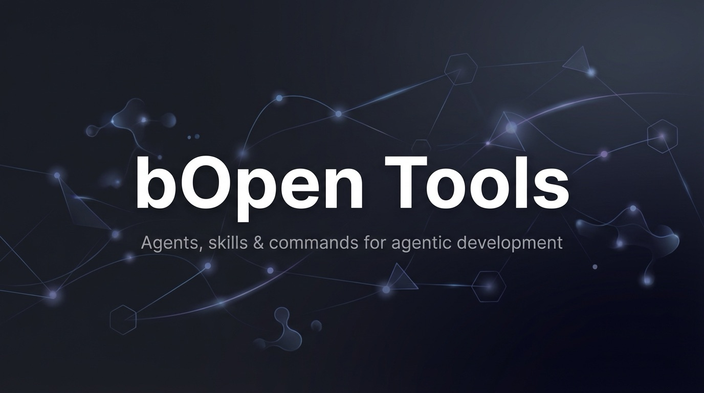

<p align="center">
  
</p>

# bOpen Tools: Prompts, Skills & AI Agents

**A shared toolkit for Claude Code, Codex, Grok Build, and OpenCode** with specialist
agents, skills, orchestration patterns, safety hooks, and reusable
development workflows.

## What This Repository Does

This repository provides:

- **Specialized AI agents** for design, security, documentation, architecture,
  testing, payments, infrastructure, and more
- **Cross-agent skills** shared by Claude Code, Codex, Grok Build, and OpenCode
  (`SKILL.md` is drop-in on OpenCode — it also reads `.claude/skills/`)
- **Runtime-specific hooks** that preserve the same safety and workflow intent
  on Claude Code (`claude-hooks.json`), Codex (`codex-hooks.json`), and Grok
  Build (`hooks/hooks.json`). OpenCode has no hooks file — the equivalent is a
  plugin event handler (`.opencode/plugin(s)/*.ts`)
- **Agent Master setup UI** for auditing the local harness, viewing purchased
  packs, opening advertised skill interfaces, and building runtime-specific
  setup plans without silently installing anything
- **Orchestration patterns** that keep a strong main model on judgment, wrap
  cheaper implementation workers in visible native controllers, support a
  read-only Fable advisor, and let humans edit the plan on an AI Elements
  workflow canvas before execution
- **Claude Code slash commands** for common workflows

See [CHANGELOG.md](CHANGELOG.md) for release notes and the reconstructed
historical baseline.

## Installation

`core` holds the shared foundation: session context, setup and hook
management, completion auditing, session recall, routing, identity work, and
every hook. Everything else ships as an optional **module** you install
alongside it.

`pack` in this project always means a premium prompt pack. Plugin
distributions are modules.

```bash
/plugin install core@b-open-io
codex plugin add core@b-open-io
grok plugin install core@b-open-io --trust
```

### Modules

| Module | Contents |
|---|---|
| `orchestra` | coordinator, advisor, orchestrator, wave-coordinator, software-factory, deploy-agent-team, claudex; agent-builder |
| `plugin-kit` | agent lifecycle, benchmarks, plugin settings, publishing; prompt-engineer, trainer |
| `review` | visual review and proposals, code audit scripts, Codex Security, Vercel Security Dashboard posture guidance, bug hunting, free-roam testing; code-auditor, security-ops, architecture-reviewer, consolidator, tester |
| `web-dev` | frontend performance, shadcn auditing, Next.js scaffolding and upgrades, charting, generative UI, Chrome inspection; designer, nextjs, optimizer, mobile |
| `creative` | Three.js, shaders, game UI, macOS design, Native SDK macOS release, UI audio themes, voice cloning, media; creative-developer, audio-specialist, native-desktop, cartographer |
| `mcp-dev` | MCP Apps and the json-render framework; mcp |
| `dev-ops` | deployment scripts, Vercel Security Dashboard CI guidance, CI waiting, process cleanup, cost tracking, payments; devops, database, data, integration-expert, payments |
| `research` | X research and lookups, persona capture, NotebookLM; researcher, documentation-writer, executive-assistant |
| `brand-rep` | personas for public surfaces; account-manager, social-media-manager |

```bash
/plugin install orchestra@b-open-io
codex plugin add orchestra@b-open-io
grok plugin install orchestra@b-open-io --trust
```

Install only what you need. Codex allocates roughly two percent of the model's
context window to skills across *every* installed plugin, so an unused module
spends budget another plugin could have used.

Some agents reference skills published outside this marketplace. They name
the install command when a skill is missing. They do not wrap those products.

| Agent | Needs | Install |
|---|---|---|
| `brand-rep:social-media-manager` (Alex) | `marketing-skills:social`, `:copywriting`, `:copy-editing` | `claude plugin install marketing-skills@coreyhaines31` |
| `brand-rep:social-media-manager` (Alex) | Typefully fallback, only when no first-party scheduler is available and the user wants Typefully | `npx skills add typefully/agent-skills` |
| `core:front-desk` / `dev-ops:integration-expert` | Resend email | `npx skills add resend/resend-skills` |
| `plugin-kit:prompt-engineer` (Zack) | `marketing-skills:copywriting`, `:copy-editing` | `claude plugin install marketing-skills@coreyhaines31` |

Those packages are not redistributed here. Corey Haines' `marketingskills` is
MIT. Typefully and Resend publish their own skills — do not wrap their APIs
in this repo.

### Codex

Add this repository as a Codex marketplace, then install the plugin:

```bash
codex plugin marketplace add b-open-io/prompts --ref master
codex plugin add core@b-open-io
```

The Codex plugin installs the shared skills and Codex-specific hooks. Codex
custom-agent files are configured separately because Codex discovers them from
project or user agent directories rather than from a plugin manifest.

#### Install Codex custom agents

Ask Codex to invoke the explicit setup skill:

```text
Use $core:codex-agent-setup to install the curated agents for this project.
```

The default installs a curated adapter set into the current project's
`.codex/agents/` directory. To make the full roster available across projects:

```text
Use $core:codex-agent-setup to install all agents in user scope.
```

From a repository checkout, the equivalent commands are:

```bash
# Curated roster in this project (the safe default)
bash skills/codex-agent-setup/scripts/setup.sh

# Full roster in ${CODEX_HOME:-~/.codex}/agents/
bash skills/codex-agent-setup/scripts/setup.sh --user --all
```

The installer copies regular TOML files atomically, tracks only files it owns,
preserves user modifications and unrelated agents, and never changes
`~/.codex/config.toml`. Start a new Codex session after setup so the agents are
discovered. Installed runtime agent names use the `bopen_` prefix and
underscores, such as `bopen_agent_builder` and `bopen_code_auditor`. Generated
filenames retain the readable `bopen-*.toml` convention.

### Grok Bot

Paste this first into a Grok Bot that can create teammates:

```text
Fetch https://bopen.ai/install/grok-bot.md and follow it exactly. Stand up the bOpen.ai roster as Grok Bot teammates.
```

The long form that URL will serve is [docs/grok-bot.md](docs/grok-bot.md) (https://bopen.ai/install/grok-bot.md once the site PR lands). That bot fetches `agents/front-desk.md` with `gh api` and asks first. It does not clone this repo.

There is no marketplace install command for Grok Bot. Creating teammates from the roster file is the install path.

### Updating

Use each host's marketplace update path; do not copy files into a plugin cache
or rely on `git pull` to refresh an installed plugin.

```bash
# Claude Code
claude plugin update core@b-open-io

# Codex: refresh the marketplace snapshot before reinstalling/updating
codex plugin marketplace upgrade
codex plugin add core@b-open-io
```

Start a fresh Claude Code or Codex session after updating so cached plugin
metadata, skills, agents, and hooks are reloaded.

BitPlan is an app-owned external provider rather than a copied core skill.
Install it from the same bOpen marketplace with
`/plugin install bitplan@b-open-io`, or install only its canonical skill with:

```bash
npx skills add opldotdev/bitplan.dev --skill bitplan -g
```

The plugin exposes `Skill(bitplan:bitplan)`; a standalone install exposes
`Skill(bitplan)`. Workflows accept either form and use the same upstream file.

### Skills only

For other agentic frameworks, install individual skills:

```bash
bunx skills add b-open-io/prompts --skill <skill-name>
```

The list below is the authored core inventory. App-owned and third-party skills are
vendored inside the module that ships them and tracked in that module's
`skills-lock.json` (for example
[`modules/mcp-dev/skills-lock.json`](modules/mcp-dev/skills-lock.json)),
keeping their upstream provenance.

<details>
<summary><strong>Authored skills — click to expand</strong></summary>

```bash
bunx skills add b-open-io/prompts --skill auth-md
bunx skills add b-open-io/prompts --skill check-version
bunx skills add b-open-io/prompts --skill codex-agent-setup
bunx skills add b-open-io/prompts --skill confess
bunx skills add b-open-io/prompts --skill front-desk
bunx skills add b-open-io/prompts --skill hammertime
bunx skills add b-open-io/prompts --skill hook-manager
bunx skills add b-open-io/prompts --skill humanize
bunx skills add b-open-io/prompts --skill linear-planning
bunx skills add b-open-io/prompts --skill reinforce-skills
bunx skills add b-open-io/prompts --skill remind
bunx skills add b-open-io/prompts --skill runtime-context
bunx skills add b-open-io/prompts --skill setup
bunx skills add b-open-io/prompts --skill visual-wayfinder
```

</details>

## Specialized AI Agents

The canonical agent personas live in [agents/](agents/). Claude Code loads them
directly from the plugin. Codex uses generated TOML adapters derived from those
same files, installed with the explicit setup described above. Every file in
`agents/` is an installable plugin persona. App-specific persistent deployments
and user-created agents stay in their owning projects and are not cataloged as
core members.

### Development & Architecture

### Platform & Infrastructure

### Specialized Domains
- 📣 **marketer** — Caal — Moved to `product-skills:marketer`
- 🗂️ [**project-manager**](agents/project-manager.md) — Wags — Linear planning, issue tracking, project organization

### Content & Communication
- 🎮 [**community-manager**](agents/community-manager.md) — Ordi — 1Sat Ordinals Discord bot, BSV community engagement

### Organization & Operations
- 🏢 [**front-desk**](agents/front-desk.md) — Martha — Team directory, routing, service provider lookup, and host install paths (Claude Code, Codex, Grok Build, Grok Bot)
- Third-party: `vercel-labs/is-agentic@is-agentic` — score a public site’s agent readiness. Install: `npx skills add vercel-labs/is-agentic`.

**Usage:** In Claude Code, request the plugin agent by name (for example,
`review:code-auditor`). In Codex, use its installed adapter name (for
example, `bopen_code_auditor`). If a Codex adapter is missing, run the setup
skill rather than pretending the specialist was spawned.

## Skills

Skills are context-triggered capabilities. They activate automatically or can be invoked directly. Install individually with `bunx skills add b-open-io/prompts --skill <name>`.

### X/Twitter
| Skill | Description |
|-------|-------------|
| `x-research` | AI-powered X/Twitter research via the newest available general-purpose Grok model (requires `XAI_API_KEY`) |
| `x-tweet-fetch` | Fetch individual tweets by ID via X API v2 |
| `x-tweet-search` | Search recent X/Twitter posts by query (last 7 days) |
| `x-user-lookup` | Look up X/Twitter user profiles by username |
| `x-user-timeline` | Get recent tweets from an X/Twitter user |

`x-research` resolves the live xAI model catalog at the start of each research
task and selects the newest canonical general-purpose Grok model. Generic
`latest` aliases are treated as automatic selection because provider aliases
can lag; set a versioned `XAI_RESEARCH_MODEL` only when a reproducible pin is
intentional.

### Content & Media
| Skill | Description |
|-------|-------------|
| `charting` | Full-stack data visualization and charting |
| `cli-demo-gif` | Generate CLI demo GIFs using vhs (Charmbracelet) |
| `generative-ui` | Guardrailed JSON Render interfaces with flat specs, small catalogs, deterministic directives, and text fallbacks |
| `html-to-pdf` | Design print-ready collateral and render it through a Playwright PDF pipeline |
| `humanize` | Preserve facts and house style while removing clustered AI-writing patterns, unsupported significance, vague attribution, promotional drift, canned change summaries, and template-like sales copy; outbound drafts use attributed examples and supplied account facts without inventing commercial claims |
| `persona` | Capture writing style profiles and social intelligence |
| `ui-audio-theme` | Audit and wire existing products, then generate, visually edit, reassign, and audition cohesive app, game HUD, and TV navigation sound themes — via ElevenLabs samples or a synthesized cuelume web micro-interaction path, guided by a production-agnostic interaction taxonomy |
| `visual-proposal` | Present an unbuilt design, RFC, roadmap, or options space as a grounded, diagram-led HTML proposal. For real decisions it runs named roster-agent advocates → cross-examination → a judging bench → the CEO's final call. It names specifications, humanizes every voice, and turns every decision into a questionnaire that explains each option's consequences. Plans can stay local, use an Artifact, or publish through the external BitPlan provider with explicit wallet approval. |
| `visual-wayfinder` | Turn one active Wayfinder decision into a build-free visual workbench with structured controls and consequence previews |
| `voice-clone` | Clone voices using ElevenLabs Instant Voice Cloning |

### Development & Quality
| Skill | Description |
|-------|-------------|
| `benchmark-skills` | Write evals for skills and measure impact vs baseline |
| `chrome-cdp` | Drive Chrome through a Bun-native Chrome DevTools Protocol CLI |
| `code-audit-scripts` | Deterministic security and quality scans (secrets, debug artifacts) |
| `codex-security` | Run OpenAI's agentic security scanner (`@openai/codex-security`) over a repo, PR, or diff, then triage, export, and gate on its findings |
| `confess` | Analyze and document code issues and technical debt |
| `create-next-project` | Scaffold a new Next.js app with Bun and Biome |
| `design-game-ui` | Convert app content into controller/remote-first game HUD and television interfaces, composing audio, visual, 3D, performance, and QA specialists as needed |
| `free-roam-testing` | Explore a running app like a curious human to discover new bugs and UX failures |
| `frontend-performance` | Optimize Next.js performance using Lighthouse and bundle analysis |
| `github-stars` | Add GitHub star counts and social proof widgets |
| `hunter-skeptic-referee` | Adversarial bug hunting with three isolated agents |
| `native-sdk-macos-release` | Scaffold or ship a Vercel Native SDK macOS app: native check/build, Developer ID sign, DMG, notary, staple |
| `nextjs-upgrade` | Upgrade Next.js to latest version with Turbopack |
| `npm-publish` | Publish packages to npm from the synced default branch with changelog/version management and browser confirmation |
| `perf-audit` | Run local performance audits without network calls |
| `shaders` | Custom shaders for Three.js and WebGL |
| `shadscan` | Drive the shadscan analyzer to audit and raise a shadcn app's UI-fundamentals score, and gate it in CI |
| `threejs-r3f` | Building Three.js and React Three Fiber projects |
| `visual-review` | Turn a PR, branch, or diff into a plain-language visual HTML review with grounded diagrams and consequence-aware questionnaires for unresolved decisions |

### Agent & Plugin Management
| Skill | Description |
|-------|-------------|
| `agent-auditor` | Comprehensive audit for agents and skills across the plugin ecosystem |
| `agent-decommissioning` | Retire and remove agents from the team |
| `agent-onboarding` | End-to-end checklist for adding a new agent |
| `codex-agent-setup` | Explicitly install, check, update, or uninstall Codex custom-agent adapters |
| `hammertime` | Write behavioral guardrail rules for the HammerTime stop hook |
| `hook-manager` | Discover and install automation hooks |
| `plugin-settings` | Choose official Claude Code configuration, project-owned state, or Agent Master skill-interface discovery without conflating them |
| `reinforce-skills` | Inject skill/agent routing maps into CLAUDE.md |
| `publish-request` | Prepare a human-reviewed release request without executing the publish |
| `skill-publish` | Publish and version bump plugins |

### Operations & DevOps
| Skill | Description |
|-------|-------------|
| `check-version` | Check if core plugin is up to date |
| `cost-tracking` | Track and report model and agent operating costs |
| `devops-scripts` | Shell scripts for infrastructure health checks |
| `linear-planning` | Plan projects and features using Linear |
| `notebooklm` | Query Google NotebookLM for source-grounded answers |
| `process-cleanup` | Find and clean up stale/resource-hungry processes |
| `remind` | Search and recall previous Claude Code conversation sessions |
| `runtime-context` | Detect agent execution environment (Claude Code, Vercel Sandbox, etc.) |
| `setup` | Audit the local agent harness and build a runtime-specific setup plan in Agent Master |
| `statusline-setup` | Configure custom statusline for Claude Code |
| `wait-for-ci` | Wait for CI/CD pipelines to complete and act on results |

### Integrations
| Skill | Description |
|-------|-------------|
| `auth-md` | Design and validate WorkOS auth.md agent registration, ID-JAG, claim flows, Better Auth adapters, and delegated credential security without conflating adjacent protocols |
| `mcp-apps` | Build secure MCP Apps with negotiated capabilities, exact CSP, structured data, and useful text fallbacks |
| `plaid-integration` | Banking data via Plaid API |

### Organization
| Skill | Description |
|-------|-------------|
| `front-desk` | Team directory, agent routing, and service provider lookup |

## Slash Commands

Slash commands are a Claude Code surface. Codex users invoke the corresponding
skills in natural language or with `$skill-name`. Claude commands use category
subdirectories, so nested files become category-prefixed commands while
root-level files keep their filename as the command.

- `/bug-hunt` - Adversarial bug hunt with 3 isolated agents — supports path or branch diff mode
- `/prime` - Context warm-up — loads git state, plugin inventory, and project conventions
- `/question` - Read-only Q&A mode — answers questions about the codebase without making changes
- `/diagnose` - Fan out 3-5 agents to investigate a bug from every angle simultaneously
- `/factory-init` - Design and scaffold an autonomous agent loop with explicit goals, gates, state, stop conditions, factory-aware Looptop telemetry, repository-policy preflight, and human-readable GitHub PRs
- `/impact` - Map the full blast radius before changing a file or function
- `/review-wave` - 4 specialized reviewers examine changes simultaneously (security, perf, correctness, style)
- `/hammertime` - HammerTime behavioral rules — status dashboard (no args) or create a rule from a description
- `/hammertime:status` - HammerTime status dashboard (alias for `/hammertime` with no args)
- `/hammertime:manage` - Interactive rule management — enable, disable, remove, view, test rules
- `/hammertime:start` - Resume the HammerTime stop hook
- `/hammertime:stop` - Pause HammerTime until it is explicitly resumed
- `/visual-review` - Build a self-contained visual recap of a PR, branch, commit, or working-tree diff
- `/utils:context` - Generate repo context snapshot for agents

## Automation Hooks

Hooks are distributed with each plugin manifest; do not copy them into a home
directory. Shared scripts implement the common behavior, while
`hooks/claude-hooks.json` and `hooks/codex-hooks.json` adapt event names and
capabilities for each host. Hook commands use the host-provided plugin root
first and fall back to the newest installed core cache if an in-session update
has replaced that versioned directory.

| Hook | Claude Code | Codex | Description |
|------|-------------|-------|-------------|
| `session-context` | SessionStart | SessionStart | Injects bounded branch, history, and plugin context |
| `repo-freshness` | SessionStart | SessionStart | Non-destructively fast-forwards the active repo's branch/default ref to its remote when strictly behind; warns on divergence, never touches a dirty tree, never prompts |
| `prompt-router` | UserPromptSubmit | — | Injects concise skill and agent routing hints with session deduplication |
| `bouncer` | Bash PreToolUse | Shell PreToolUse | Validates commands against safety rules |
| `damage-control` | Bash/write/edit PreToolUse | Shell/`apply_patch` PreToolUse | Protects sensitive paths and destructive operations |
| `publish-gate` | Bash PreToolUse | Shell PreToolUse | Guards publish commands behind release checks |
| browser guidance | `agent-browser-solo` on WebFetch | `browser-intent` on UserPromptSubmit | Encourages isolated browser automation without injecting page content into privileged hook context; ordinary Claude WebSearch remains native |
| `roster-guard` | Task PreToolUse | — | Warns when a generic Claude subagent is used where a roster specialist fits |
| `skill-activity` | Skill PreToolUse | — | Records bounded skill activity for the session UI and diagnostics |
| `hammertime` | Stop | Stop | Applies behavioral guardrails and can request another turn |

On first use, Codex may ask you to review and trust plugin hooks. Inspect the
commands before approving them. Do not use hook-trust bypass flags for normal
work; they exist for controlled diagnostics, not routine installation.

### HammerTime Stop Hook

HammerTime is a behavioral guardrail system that runs on every assistant response. It catches rule violations using three-layer scored detection:

| Layer | Signal | Score | Purpose |
|-------|--------|-------|---------|
| Keywords | Case-insensitive substring match | +1 each | Broad detection |
| Intent Patterns | Regex structural matching | +2 each | Paraphrase catching |
| Co-occurrence | Dismissal verb + qualifier in same sentence | +3 | Highest confidence |

**Score thresholds:** 0 = pass, 1-4 = optional Haiku verification, 5+ =
direct block. The verifier runs only when `ANTHROPIC_API_KEY` is configured;
otherwise an ambiguous match blocks conservatively. When it runs, it sends the
rule and up to the last 4,000 characters of the assistant response to
Anthropic. Complete single-quoted, double-quoted, and backtick-delimited spans
are excluded from deterministic scoring so examples, documentation, and search
terms do not masquerade as the assistant's own behavior.

**Loop safety:** Each rule has a `max_iterations` field (default: 3). The hook
tracks blocks per session and auto-allows exit when the limit is hit. Counters
reset on new sessions. Set `0` for unlimited. Existing Claude installations
continue to use `~/.claude/hammertime`; otherwise the cross-host default is
`~/.core/hammertime`. Set `BOPEN_HAMMERTIME_HOME` to override it.

**Per-project rules:** Set `cwd_prefix` to a path string or an array of path
strings to evaluate a rule only in matching projects; omit it for a global
rule. HammerTime uses `CLAUDE_PROJECT_DIR` exactly when that environment
variable is set, otherwise `os.getcwd()`, and applies string `startswith`
matching after expanding `~` in each configured prefix. A malformed
`cwd_prefix` is skipped with a stderr warning instead of failing the hook.

**Full-turn evaluation:** Rules can opt into scoring ALL assistant messages since the user's last message (not just the final one). This catches violations in intermediate responses — e.g., the model dismisses an error mid-turn, then the final message just says "Done." Set `"evaluate_full_turn": true` on a rule to enable. The hook reads the session transcript JSONL backwards (last 2MB max).

Ships with a built-in `project-owner` rule that prevents dismissing errors as "pre-existing" (full-turn enabled).

#### Commands

| Command | Purpose |
|---------|---------|
| `/hammertime` | Status dashboard (no args) or create a rule from a description |
| `/hammertime:manage` | Interactive management — enable, disable, remove, view, test |
| `/hammertime:status` | Status dashboard (alias) |

#### Debugging

```bash
export HAMMERTIME_DEBUG="$HOME/.core/hammertime/debug.log"
```

Debug log shows elapsed time, score breakdowns, transcript reads, and phase decisions:

```
[   1ms] LAST_MSG length: 2847 chars
[   3ms] TRANSCRIPT: found 7d5d184f-...jsonl
[   8ms] TRANSCRIPT: collected 3 assistant blocks, 4201 chars
[   8ms] FULL_TURN: scoring 1 rules against 4201 chars
[   9ms] SCORE: rule 'project-owner' score=7 (kw=3, intent=1, cluster=1)
[   9ms] BLOCK: score 7 >= 5, skipping Phase 2
```

Rules live under the selected HammerTime home. See the
[hammertime skill](skills/hammertime/SKILL.md) for the full rule authoring
guide.

## Agent Master and Unified Setup

The `setup` skill launches a local Agent Master UI that re-detects the current
harness on every refresh. It inventories bOpen plugins, Codex agent delivery,
CLIs, environment-key presence, third-party skills, and hook state; the UI then
turns selected gaps into a runtime-specific instruction plan for a human or
parent agent to execute. The zero-install fallback remains read-only. In the
playground, pack dependencies run only after an explicit **Install missing**
action and only from validated manifest fields.

Agent Master also exposes a signed-in **My Packs** library. Purchased packs are
matched to the current machine, their plugin dependencies are checked locally,
and missing requirements become explicit setup-plan steps. Launching setup with
`--pack <toc.json|pack.json>` computes the pack's complete plugin closure and
shows required-versus-installed dependencies for Claude Code, Codex, and Grok
Build.

Plugins may also declare optional `skillInterfaces` entries in
`setup/manifest.json`. Agent Master renders these as trusted bopen.ai links in
the plugin detail view; they advertise a skill-owned dashboard or configurator
without granting capabilities, persisting settings, or requiring the skill to
own a separate build. This release uses that contract for **Visual Wayfinder**.

When Agent Master is launched through Portless with `--agent-master`, it also
exposes an origin-restricted local broker at
`https://agent-master.localhost`. Skill pages on bopen.ai can detect that
explicit session and request one of three compiled-in interfaces: Deck
Creator, Visual Planner, or Visual Wayfinder. Each tool runs on its own named
Portless origin; the website never submits an arbitrary command or filesystem
path, and returned launch URLs are checked against the expected tool hostname.
The signed Agent Master desktop release uses this same broker as a Next.js
standalone build bundled with its pinned Bun and Portless runtimes, so desktop
users do not need a bOpen Tools checkout or global JavaScript tooling.

That desktop release keeps itself current through the broker. The shell hands
over the version, bundle path, and process id it was launched with; the broker
asks `bopen.ai/api/releases/agent-master/latest` whether a newer build exists on
the install's own channel, and offers to fetch it using the same signed-in
bopen.ai session that unlocks packs. A release is verified before it is trusted:
the disk image must carry the version the feed advertised, pass `codesign`, and
pass Gatekeeper assessment on the production channel. Applying is a second,
explicit step that quits the app, swaps the bundle, and reopens it, keeping the
outgoing bundle until the replacement lands. Running `playground_server.ts`
directly — with or without `--agent-master` — never receives that handshake, so
a setup session with no application around it is told the host is unsupported
and offers nothing.
Managed interfaces allow up to 90 seconds for a cold production start before
reporting a launch failure. For HTTP Portless routes, the readiness probe
connects to the loopback proxy while preserving the tool's named origin in the
`Host` header using a direct loopback socket that bypasses environment proxy
settings. This keeps routing deterministic on machines whose resolver does not
support multi-label `.localhost` names or whose HTTP proxy ignores `NO_PROXY`;
the browser still receives the normal named tool URL.

```bash
portless agent-master bun skills/setup/scripts/playground_server.ts \
  --runtime <claude|codex|grok|opencode|hermes|generic> \
  --agent-master
```

Plugin and skill controls are declared in `settings.json` files validated by
[`settings.schema.json`](settings.schema.json). The SessionStart hook may inject
only declarations that opt into session context; sensitive values are always
excluded. See [settings declarations](docs/settings-declarations.md) for the
contract.

Ask an agent to use `core:setup`, or launch the fallback directly from
an installed plugin root:

```bash
bun skills/setup/scripts/server.ts --runtime <claude|codex|grok|opencode|hermes|generic> [--pack <toc.json|pack.json>]
```

## Custom Statusline

**Moved to Plugin:** Statusline is now distributed as the `claude-peacock` plugin.

### Installation

```bash
/plugin marketplace add b-open-io/claude-plugins
/plugin install claude-peacock@b-open-io
```

Auto-configures on first session with:
- **Project tracking** - Shows CWD (⌂) and last edited project (✎)
- **Lint status** - Error/warning counts
- **Git branch** - Branch name with dirty indicator (*)
- **Clickable file paths** - OSC 8 hyperlinks to open in your editor
- **Peacock themes** - 24-bit true color from VSCode settings

### Configuration

No configuration needed - auto-detects code directory and editor!

Optional overrides:
```bash
export CODE_DIR="$HOME/custom/path"    # Override auto-detected code directory
export EDITOR_SCHEME="vscode"          # Override auto-detected editor
```

See the [claude-peacock plugin](https://github.com/b-open-io/claude-peacock) for full documentation.

## Repository Structure

```
prompts/
├── .claude-plugin/         # Claude Code plugin manifest
├── .codex-plugin/          # Codex plugin manifest
├── .agents/plugins/        # Codex marketplace manifest
├── agents/                 # Canonical authored agent personas
├── bots/                   # ClawNet deployment metadata
├── codex/agents/           # Generated Codex TOML adapters
├── commands/               # Claude Code slash commands
│   ├── factory-init.md      #   /factory-init
│   ├── hammertime/         #   /hammertime:* controls
│   └── utils/              #   /utils:context
├── hooks/                  # Shared scripts + host-specific hook manifests
├── plans/                  # Reviewed planning deliverables; implementation remains separately gated
├── skills/                 # Cross-agent skills (each has SKILL.md)
├── setup/manifest.json      # Declarative Agent Master dependency inventory
├── settings.json            # Repository-level settings declarations
├── settings.schema.json     # Settings declaration schema
├── benchmarks/             # Benchmark results (latest.json)
├── .github/workflows/      # validate, isolated-install, and promote-dev gates
├── scripts/
│   ├── codex-agents/       # Adapter generator and safe installer
│   ├── prompts-factory-worker.sh # LoopTop worker that keeps the dev → master PR current
│   ├── test-isolated-plugin-install.sh # Disposable-runner plugin install gate
│   ├── check-plugin-extraction.py # Per-plugin git-subdir extraction gate
│   ├── benchmark.tsx       # Skill output-quality benchmark CLI
│   ├── plugin-weight.py    # Static catalog/context inventory
│   ├── capture-*-context.py # Exact Claude/Codex host snapshots
│   └── run-plugin-harness.py # Deterministic + live release matrix
├── docs/                   # Design notes and user-facing contracts
├── references/             # Shared agent reference documentation
├── tsconfig.json           # JSX config for benchmark CLI
├── CHANGELOG.md
├── README.md
└── QUICKSTART.md
```

### One source of truth, two host adapters

The repository avoids parallel hand-maintained copies:

- `agents/*.md` is the canonical persona and instruction source. The committed
  `codex/agents/*.toml` files are deterministic generated artifacts, and the
  generator's `--check` mode catches drift.
- Codex agent setup installs regular files instead of symlinks into a mutable
  plugin cache. Its ownership manifest enables safe updates without taking
  ownership of unrelated user files.
- Hook logic lives in shared scripts. The Claude and Codex JSON manifests only
  describe the different host event surfaces.
- The two plugin manifests have independent host schemas but share one release
  version and common metadata, checked by `scripts/check-plugin-manifests.py`.

Do not manually copy plugin contents into `~/.claude` or `~/.codex`, and do not
symlink agent definitions into a versioned plugin cache. Use the marketplace
and agent setup flows so upgrades remain reproducible.

### Shipping

The default branch is the published plugin and is protected. Every pull
request must pass the `validate` and `isolated-install` checks. Work lands on
`dev` first. The factory worker (`scripts/prompts-factory-worker.sh`) keeps one
standing `dev` → default-branch pull request open and restates the review
deadline whenever `dev` changes. It needs no configuration: `/factory-init`
registers the loop with LoopTop and writes `~/.prompts-factory/loop/loop.json`,
the worker reads its checkout from that manifest, and the signed-in `gh` user
is the reviewer. `promote-dev.yml` merges the pull request only after a
24-hour cooling period and a fresh `/approve` comment from a repository owner,
member, or collaborator; a new `dev` commit resets both.

## Plugin Context Harness

Large plugin catalogs consume model context before a task begins. core
ships additive diagnostics that measure this cost without changing skill
routing:

```bash
# Static skill/agent/command inventory and weight
python3 scripts/plugin-weight.py --format markdown

# Host snapshots (exact Codex omission counts need a runtime JSONL event file)
python3 scripts/capture-codex-context.py --model gpt-5.6-sol
python3 scripts/capture-claude-context.py --source-root .

# Source versus installed Claude/Codex inventories
python3 scripts/check-plugin-install-parity.py --auto-detect

# Deterministic repository release tier
python3 scripts/run-plugin-harness.py
```

The reports distinguish startup routing metadata from on-demand skill bodies,
Claude's legacy command entries from source skills, and authored skills from
third-party symlinks. Recorded fixtures keep unit tests independent of live
models; live host probes remain a separate release tier. Codex's static
`prompt-input` view does not include its runtime budget warning, so the Codex
snapshot reports omitted skills as unknown unless supplied a recorded
`codex exec --json` event stream.

See [the context harness guide](docs/plugin-context-harness.md) for baseline
measurements and commands, and
[the domain-plugin architecture](docs/plugin-context-architecture.md) for the
planned core/optional-pack migration.

## Skill Benchmarks

Skills with benchmark coverage keep eval cases in
`skills/<name>/evals/evals.json`. Each eval runs twice — once with the skill
injected and once as a bare baseline — and an LLM judge scores each assertion
via a constrained `{grades:[...]}` schema (Messages API
`output_config.format`, or `claude -p --json-schema` when no API key).
The delta is the signal. Not every authored skill has coverage yet; the CLI
runs the skills that currently include an `evals/` directory, and new or
materially changed skills should add focused cases where the behavior can be
judged reliably.

Live results: **[bopen.ai/benchmarks](https://bopen.ai/benchmarks)**

### Eval Format

Add evals alongside any skill at `skills/<name>/evals/evals.json`:

```json
{
  "skill_name": "greet",
  "evals": [
    {
      "id": 1,
      "prompt": "Write a short README for a CLI tool called greet",
      "expected_output": "A README with installation and usage examples.",
      "files": [],
      "assertions": [
        {
          "id": "has-install-section",
          "text": "The output includes an installation section.",
          "type": "qualitative"
        },
        {
          "id": "has-usage-section",
          "text": "The output includes a usage section with an example command.",
          "type": "qualitative"
        }
      ]
    }
  ]
}
```

### Running the Benchmark CLI

```bash
# Run all skills with evals
bun run scripts/benchmark.tsx

# Run a single skill
bun run scripts/benchmark.tsx --skill humanize

# Run a skill from another plugin checkout
bun run scripts/benchmark.tsx --skill collections --skill-root /path/to/1sat-sdk

# Custom model or concurrency (use an ID available to your account)
bun run scripts/benchmark.tsx --model "${BENCHMARK_MODEL_ID:?set BENCHMARK_MODEL_ID}" --concurrency 5
```

Results are written to `benchmarks/latest.json`. Commit reviewed results to publish them to bopen.ai.

**Resume support:** Each eval result is cached by content hash
(`benchmarks/cache/`). The hash includes the model, full eval contract, and
injected skill content. Interrupted runs resume without reusing a score after
the skill or assertions change.

### Writing Evals for Your Skill

Invoke the `benchmark-skills` skill to get guided help:

```
"Use the benchmark-skills skill to help me write evals for my skill"
```

Or ask the tester agent directly:

```
"Have the tester agent write evals for the x-research skill and run the benchmark"
```

### Publishing Results

Benchmarks run **locally** using your existing Claude session — no API key needed. They are not run in CI. Commit `benchmarks/latest.json` alongside the reviewed skill changes; bopen.ai picks up the committed results via ISR.

---

## Key Features

### 🚀 Instant Productivity
- Pre-built commands for common tasks
- Expert agents for specialized work
- Automation that works in the background

### 🔗 Ecosystem Integration
- Works with our entire BSV development stack
- Integrates with BigBlocks, Sigma Identity, and more
- Compatible with init-prism project generation

### 🛠️ Extensible
- Create custom commands with prompt-engineer
- Modify agents for your workflow
- Build new automation hooks

## Advanced Usage

### Working with Agents

Agents can be explicitly requested for specific tasks. Use Claude plugin IDs or
Codex adapter IDs according to the current host:

```
"Use plugin-kit:prompt-engineer to create a deployment command"   # Claude
"Have bopen_code_auditor review the authentication boundary"      # Codex
"Ask bopen_designer to review this component system"              # Codex
```

### Orchestration: main seat, workers, advisor

Use the `orchestrator` skill when the current Claude Code, Codex, Grok
Build, or OpenCode main should retain the plan, judgment, verification, and git ownership
while other lanes do bounded work. Grok Build also ships a native `workflow`
tool (Rhai scripts, `/workflows` dashboard). Codex and OpenCode do not — they
sequence `codex exec` / `opencode run` dispatches from the caller.

```text
Use $orchestra:orchestrator. Keep this session in the main seat, use native
roster specialists for research and review, cheaper workers for bounded
implementation, and an advisor only for read-only second opinions at
commitment boundaries.
```

The main model is always the model selected for the current session; the skill
does not pin or rename it. The supporting skills divide responsibilities:

- `coordinator` writes precise worker specs, assigns non-overlapping files,
  dispatches implementation, and requires acceptance reports. It loads one
  shared dispatch contract, the current host guide, and only the selected
  worker guide. Non-trivial writes use isolated worktrees, all makers stop at
  a barrier before an independent read-only review, and review plus tests share
  one corrective pass. The main runs the final checks and owns git. Bounded
  implementation defaults to the cheapest authorized capable lane; native
  specialists stay focused on evidence, review, testing, and domain judgment.
- `advisor` packages a narrow, read-only consult. From a Codex main it can use
  the Claude CLI with the `fable` model-family alias. Override it with
  `BOPEN_ADVISOR_MODEL`. Fable `--safe-mode` appends
  `~/.claude/communication.md` into the system prompt. Missing file is a fail.
  The skill loads only the selected channel guide and records the provider,
  model, authentication path, context sent, and proof that the intended
  advisor ran. OpenCode consults use a permission-constrained child.
- `orchestrator` composes native specialists, Coordinator, Advisor, and staged
  waves while leaving final decisions with the main session. It delegates
  harness-specific behavior to Coordinator's on-demand references.
- `visual-coordinator` draws an editable graph of the job (nodes, labeled
  edges, reject-back gates) before it runs. Staffing, isolation,
  concurrency, refusals, and the paste-back spec live on that canvas.
  On Grok it translates to a Rhai workflow, not a vague `/workflow` brief.
  `/create-workflow` is a Grok-bundled authoring skill
  (`~/.grok/bundled/skills/create-workflow/SKILL.md`). It is not part of
  orchestra. Claude Code and Codex do not have that slash command.

External lanes cross provider boundaries. A Grok dispatch can send its prompt,
specification, and selected repository content to xAI. A Muse dispatch can send
the same class of content to Meta. A Codex / Sol / Luna dispatch can send it to
OpenAI. A Fable consult can send its consult and files inspected by read-only
tools to Anthropic. An `opencode run` dispatch can send its prompt and repository
content to whichever provider backs the pinned `provider/model` — confirm the
`opencode.json` provider block first so the destination is known. State what will be shared before first use, obtain approval
unless the user already authorized that lane, and never send secrets or
unrelated proprietary content.

Grok Build can use an API key or the account signed in through grok.com. To
select the signed-in account, unset both `XAI_API_KEY` and `GROK_API_KEY` for
preflight and dispatch, then verify that Grok reports `logged in with
grok.com`. A temporary `GROK_HOME` reduces local configuration, but the account
may still supply managed plugins and MCP servers; inspect what actually loaded
before sending repository context.

### Custom Workflows

Create project-specific automation by combining:

1. Specialized agents for expertise
2. Skills and, on Claude Code, slash commands for automation
3. Hooks for background tasks
4. Prompts for complex operations

## Common Use Cases

### Bug Hunting
```bash
/bug-hunt
```

### Documentation
```bash
"Have the documentation-writer create a comprehensive README"
```

### Agent Context
```bash
/utils:context
```


## Claude Code Permissions

Some Claude Code agents use CLI tools that require permission. To avoid
repeated prompts, add these to your `~/.claude/settings.json`:

```json
{
  "permissions": {
    "allow": [
      "Bash(agent-browser:*)",
      "Bash(curl:*)",
      "Bash(jq:*)"
    ]
  }
}
```

Or use `/permissions` to add them interactively.

## Claude Code Skill Limits & Configuration

Claude Code and Codex budget only part of the model context for skill routing
metadata. With a large global catalog, hosts may first remove descriptions and
then omit skills that no longer fit.

### Symptoms
- `/skills` shows fewer skills than expected
- Claude doesn't recognize skills you know are installed
- A startup warning reports descriptions removed or additional skills omitted

### Diagnose Before Changing the Budget

Run the context harness to separate plugin weight from the rest of the installed
catalog:

```bash
python3 scripts/plugin-weight.py --format markdown
python3 scripts/capture-claude-context.py --source-root .
python3 scripts/capture-codex-context.py
```

For an exact Codex omission count, capture a fresh `codex exec --json` run and
pass the JSONL file with `--events-file`; the static prompt alone cannot expose
the runtime budget-warning event.

Claude's `SLASH_COMMAND_TOOL_CHAR_BUDGET` can increase its listing allowance,
but that also increases the permanent startup prompt. Treat it as a diagnostic
or temporary compatibility setting, not the primary architecture.

For skills that are intentionally manual, Claude's
`disable-model-invocation: true` and Codex's
`policy.allow_implicit_invocation: false` remove them from implicit routing
while preserving direct invocation. Policy changes require routing tests before
release.

### Check Current Status

Run `/context` or `/doctor` in Claude, and use
`codex debug prompt-input` through the provided snapshot script in Codex.

## Tips & Best Practices

1. **Use agents for expertise** - They have specialized knowledge
2. **Slash commands for speed**
3. **Combine tools** - Agents + commands = powerful workflows
4. **Keep updated** - Use the marketplace update commands in the Installation section, then start a fresh session

## Need Help?

- **New to Claude Code?** See our [Quick Start Guide](QUICKSTART.md)
- **Browse the toolkit:** Start with [agents/](agents/), [skills/](skills/),
  [commands/](commands/), and the shared [references/](references/)

## Contributing

When adding new content:
1. **Commands** go in `commands/` (root-level) or `commands/[category]/`
2. **Agents** go in `agents/`
3. **Hooks** go in `hooks/`
4. **Skills** go in `skills/`
5. Use the prompt-engineer agent for creating commands
6. Test thoroughly before committing
7. Update [CHANGELOG.md](CHANGELOG.md) for every user-visible plugin change
8. Update this README whenever public inventory, setup, or release instructions change

## Skill Provenance

Two layers track skill authorship and integrity:

- **`skills-lock.json`** files (one per module under `modules/<name>/`, root file kept empty) in the Vercel Labs format record third-party skill sources, versions, and SHA256 content hashes. Ensures reproducible installs and detects tampering.
- **`.clawnet/` directories** — On-chain Bitcoin attestation (B + MAP + AIP + BAP ATTEST) for skills we author. Provides cryptographic proof of authorship anchored to the BSV blockchain.
