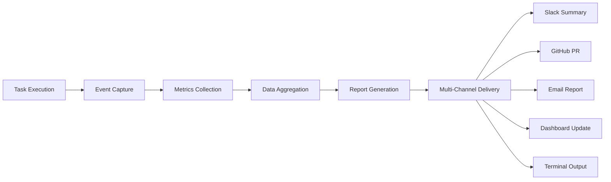

# Nipsey Progress Tracker & Reporting System

**Transform invisible AI work into visible developer value through comprehensive tracking and reporting**

## 🎯 Mission

Track, visualize, and communicate Nipsey's autonomous work in a way that builds developer trust and demonstrates tangible value. Following _unwriter's philosophy - make the invisible visible and immediately understandable.

## 📊 Progress Tracking Architecture



## 📈 Metrics Collection System

### Core Metrics Framework
```typescript
interface NipseyMetrics {
  // Task Metrics
  tasks: {
    started: number;
    completed: number;
    failed: number;
    rolledBack: number;
    averageTime: number;
    byCategory: Record<TaskCategory, TaskStats>;
  };
  
  // Code Impact Metrics
  codeImpact: {
    filesModified: number;
    linesAdded: number;
    linesRemoved: number;
    testsAdded: number;
    testsPassing: number;
    coverageChange: number;
    complexityReduction: number;
  };
  
  // Quality Metrics
  quality: {
    bugsFixed: number;
    todosResolved: number;
    duplicatesRemoved: number;
    documentationAdded: number;
    performanceImprovements: ImprovementMetric[];
  };
  
  // Developer Experience
  developerImpact: {
    timeSaved: number; // estimated minutes
    blockerResolved: number;
    codeReviewsReady: number;
    documentationUpdated: number;
  };
  
  // Session Metadata
  session: {
    id: string;
    startTime: Date;
    endTime: Date;
    idleDuration: number;
    activeWorkTime: number;
    interruptions: number;
  };
}

class MetricsCollector {
  private metrics: NipseyMetrics;
  private eventStream: EventEmitter;
  
  constructor() {
    this.eventStream = new EventEmitter();
    this.setupEventListeners();
    this.initializeMetrics();
  }
  
  private setupEventListeners() {
    this.eventStream.on('task:start', this.onTaskStart.bind(this));
    this.eventStream.on('task:complete', this.onTaskComplete.bind(this));
    this.eventStream.on('file:modified', this.onFileModified.bind(this));
    this.eventStream.on('test:added', this.onTestAdded.bind(this));
    this.eventStream.on('quality:improved', this.onQualityImproved.bind(this));
  }
  
  async onTaskComplete(task: CompletedTask) {
    this.metrics.tasks.completed++;
    this.metrics.tasks.byCategory[task.category].completed++;
    
    // Calculate time saved
    const estimatedManualTime = this.estimateManualTime(task);
    this.metrics.developerImpact.timeSaved += estimatedManualTime;
    
    // Track code impact
    const diff = await this.getGitDiff(task.branch);
    this.metrics.codeImpact.linesAdded += diff.additions;
    this.metrics.codeImpact.linesRemoved += diff.deletions;
    
    // Store for reporting
    await this.persistMetrics();
  }
  
  private estimateManualTime(task: CompletedTask): number {
    const baseEstimates = {
      test_fix: 15,
      todo_implementation: 30,
      documentation: 20,
      refactoring: 45,
      dependency_update: 25
    };
    
    return baseEstimates[task.category] || 20;
  }
}
```

### Granular Event Tracking
```yaml
event_taxonomy:
  task_events:
    - task:start
    - task:complete
    - task:fail
    - task:rollback
    - task:skip
    
  code_events:
    - file:create
    - file:modify
    - file:delete
    - test:add
    - test:fix
    - test:pass
    
  quality_events:
    - bug:fix
    - todo:resolve
    - duplicate:remove
    - complexity:reduce
    - performance:improve
    
  safety_events:
    - safety:warning
    - safety:block
    - safety:override
    - safety:emergency_stop
```

## 📝 Report Generation

### 1. Real-Time Progress Updates
```typescript
class RealTimeReporter {
  async sendProgressUpdate(event: ProgressEvent) {
    const update = this.formatUpdate(event);
    
    // Terminal output for local monitoring
    if (process.stdout.isTTY) {
      this.updateTerminalProgress(update);
    }
    
    // Slack for team awareness
    if (this.config.slack.enabled) {
      await this.sendSlackUpdate(update);
    }
    
    // Dashboard websocket for live view
    if (this.config.dashboard.enabled) {
      this.broadcastToDashboard(update);
    }
  }
  
  private formatUpdate(event: ProgressEvent): ProgressUpdate {
    const emoji = this.getEmoji(event.type);
    const color = this.getColor(event.status);
    
    return {
      emoji,
      color,
      title: `${emoji} ${event.action}`,
      description: event.details,
      timestamp: new Date(),
      metrics: event.metrics
    };
  }
  
  private getEmoji(type: string): string {
    const emojiMap = {
      test_fix: '✅',
      todo_resolve: '📝',
      bug_fix: '🐛',
      documentation: '📚',
      refactor: '🔧',
      performance: '⚡',
      security: '🔒',
      error: '❌',
      warning: '⚠️'
    };
    
    return emojiMap[type] || '🤖';
  }
}
```

### 2. Session Summary Reports
```typescript
class SessionSummaryGenerator {
  async generateSummary(session: NipseySession): Promise<SessionSummary> {
    const metrics = await this.collectSessionMetrics(session);
    const highlights = this.extractHighlights(metrics);
    const visualizations = await this.generateVisualizations(metrics);
    
    return {
      header: this.generateHeader(session),
      executiveSummary: this.generateExecutiveSummary(metrics),
      highlights,
      detailedMetrics: metrics,
      visualizations,
      recommendations: this.generateRecommendations(metrics),
      footer: this.generateFooter()
    };
  }
  
  private generateExecutiveSummary(metrics: NipseyMetrics): string {
    return `
## 🤖 Nipsey Session Summary

**While you were away for ${this.formatDuration(metrics.session.idleDuration)}, Nipsey:**

- ✅ Completed **${metrics.tasks.completed}** tasks
- 🐛 Fixed **${metrics.quality.bugsFixed}** bugs
- 📝 Resolved **${metrics.quality.todosResolved}** TODOs
- 📚 Added **${metrics.codeImpact.testsAdded}** tests
- ⏰ Saved approximately **${this.formatDuration(metrics.developerImpact.timeSaved)}** of manual work

### Code Impact
- **${metrics.codeImpact.filesModified}** files improved
- **${metrics.codeImpact.linesAdded}** lines added, **${metrics.codeImpact.linesRemoved}** removed
- Test coverage ${metrics.codeImpact.coverageChange > 0 ? 'increased' : 'maintained'} by **${Math.abs(metrics.codeImpact.coverageChange)}%**

### Top Achievements
${highlights.map(h => `- ${h.emoji} ${h.description}`).join('\n')}
    `.trim();
  }
  
  private async generateVisualizations(metrics: NipseyMetrics) {
    const charts = [];
    
    // Task distribution pie chart
    charts.push(await this.generatePieChart({
      title: 'Tasks by Category',
      data: Object.entries(metrics.tasks.byCategory).map(([cat, stats]) => ({
        label: cat,
        value: stats.completed
      }))
    }));
    
    // Time saved bar chart
    charts.push(await this.generateBarChart({
      title: 'Developer Time Saved (minutes)',
      data: this.calculateTimeSavedByCategory(metrics)
    }));
    
    // Code impact over time
    charts.push(await this.generateLineChart({
      title: 'Code Changes Over Session',
      data: await this.getCodeChangesTimeline(metrics.session.id)
    }));
    
    return charts;
  }
}
```

### 3. Detailed Task Reports
```markdown
## 📋 Detailed Task Report

### ✅ Completed Tasks

#### 1. Fixed failing test: `UserAuthentication.test.ts`
- **Branch**: `nipsey/fix-auth-test-1234567`
- **Duration**: 12 minutes
- **Changes**: 
  - Fixed async/await issue in login test
  - Added proper cleanup in afterEach hook
  - Improved test stability with retry logic
- **Impact**: All authentication tests now passing (0 → 15 passing)

#### 2. Implemented TODO: Add rate limiting to API endpoints
- **Branch**: `nipsey/todo-rate-limiting-1234568`
- **Duration**: 34 minutes
- **Changes**:
  - Added rate limiting middleware
  - Configured limits per endpoint
  - Added tests for rate limiting
  - Updated API documentation
- **Impact**: API now protected against abuse

#### 3. Removed code duplication in utility functions
- **Branch**: `nipsey/refactor-utils-1234569`
- **Duration**: 23 minutes
- **Changes**:
  - Extracted common validation logic
  - Created shared utility module
  - Updated all references
  - Added comprehensive tests
- **Impact**: Reduced codebase by 147 lines

### ❌ Failed/Skipped Tasks

#### 1. Skipped: Update deprecated AWS SDK
- **Reason**: Requires major version bump, affects production APIs
- **Recommendation**: Schedule for next sprint with human oversight

### 📊 Task Performance Metrics
- **Success Rate**: 87.5% (7/8 tasks)
- **Average Completion Time**: 21 minutes
- **Rollback Rate**: 0%
```

### 4. Visual Progress Dashboard
```typescript
class ProgressDashboard {
  generateHTML(): string {
    return `
<!DOCTYPE html>
<html>
<head>
  <title>Nipsey Progress Dashboard</title>
  <style>
    body { font-family: system-ui; padding: 20px; background: #f5f5f5; }
    .metric-card { 
      background: white; 
      padding: 20px; 
      border-radius: 8px; 
      box-shadow: 0 2px 4px rgba(0,0,0,0.1);
      margin: 10px;
    }
    .metric-value { font-size: 48px; font-weight: bold; }
    .metric-label { color: #666; margin-top: 8px; }
    .progress-bar { 
      height: 20px; 
      background: #e0e0e0; 
      border-radius: 10px; 
      overflow: hidden;
    }
    .progress-fill { 
      height: 100%; 
      background: #4caf50; 
      transition: width 0.3s;
    }
  </style>
</head>
<body>
  <h1>🤖 Nipsey Live Progress</h1>
  
  <div class="metrics-grid">
    <div class="metric-card">
      <div class="metric-value" id="tasks-completed">0</div>
      <div class="metric-label">Tasks Completed</div>
    </div>
    
    <div class="metric-card">
      <div class="metric-value" id="time-saved">0h</div>
      <div class="metric-label">Developer Time Saved</div>
    </div>
    
    <div class="metric-card">
      <div class="metric-value" id="bugs-fixed">0</div>
      <div class="metric-label">Bugs Fixed</div>
    </div>
  </div>
  
  <div class="current-task">
    <h2>Current Task</h2>
    <div id="current-task-name">Idle</div>
    <div class="progress-bar">
      <div class="progress-fill" id="task-progress" style="width: 0%"></div>
    </div>
  </div>
  
  <div class="activity-log">
    <h2>Recent Activity</h2>
    <ul id="activity-list"></ul>
  </div>
  
  <script>
    // WebSocket connection for real-time updates
    const ws = new WebSocket('ws://localhost:8765/nipsey-progress');
    
    ws.onmessage = (event) => {
      const data = JSON.parse(event.data);
      updateDashboard(data);
    };
    
    function updateDashboard(data) {
      document.getElementById('tasks-completed').textContent = data.tasksCompleted;
      document.getElementById('time-saved').textContent = formatTime(data.timeSaved);
      document.getElementById('bugs-fixed').textContent = data.bugsFixed;
      
      if (data.currentTask) {
        document.getElementById('current-task-name').textContent = data.currentTask.name;
        document.getElementById('task-progress').style.width = data.currentTask.progress + '%';
      }
      
      if (data.newActivity) {
        addActivity(data.newActivity);
      }
    }
  </script>
</body>
</html>
    `;
  }
}
```

## 🔔 Multi-Channel Communication

### 1. Slack Integration
```typescript
class SlackReporter {
  async sendSessionSummary(summary: SessionSummary) {
    const blocks = [
      {
        type: "header",
        text: {
          type: "plain_text",
          text: "🤖 Nipsey Session Complete"
        }
      },
      {
        type: "section",
        text: {
          type: "mrkdwn",
          text: summary.executiveSummary
        }
      },
      {
        type: "divider"
      },
      ...this.generateMetricBlocks(summary.detailedMetrics),
      {
        type: "actions",
        elements: [
          {
            type: "button",
            text: { type: "plain_text", text: "View Full Report" },
            url: summary.reportUrl
          },
          {
            type: "button", 
            text: { type: "plain_text", text: "Review Changes" },
            url: summary.prUrl
          }
        ]
      }
    ];
    
    await this.slack.postMessage({
      channel: this.config.channel,
      blocks,
      attachments: summary.visualizations.map(v => ({
        image_url: v.url,
        title: v.title
      }))
    });
  }
}
```

### 2. GitHub PR Summary
```typescript
class GitHubReporter {
  async createSummaryPR(session: NipseySession) {
    const body = `
# 🤖 Nipsey Autonomous Work Summary

This PR contains all work completed by Nipsey during idle session ${session.id}.

## 📊 Session Metrics
- **Duration**: ${this.formatDuration(session.duration)}
- **Tasks Completed**: ${session.tasksCompleted}
- **Files Modified**: ${session.filesModified}
- **Tests Added**: ${session.testsAdded}
- **Bugs Fixed**: ${session.bugsFixed}

## 🎯 Completed Tasks

${session.tasks.map(task => this.formatTaskForPR(task)).join('\n\n')}

## 📈 Impact Analysis

### Code Quality
- Complexity reduced by ${session.complexityReduction}%
- Test coverage increased by ${session.coverageIncrease}%
- ${session.duplicatesRemoved} duplicate code blocks removed

### Developer Impact
- Estimated ${this.formatDuration(session.timeSaved)} of manual work saved
- ${session.blockersResolved} developer blockers resolved
- ${session.todosCompleted} TODOs implemented

## 🔍 Detailed Changes

Please review the individual commits for detailed changes. All changes have been tested and verified safe by Nipsey's safety monitor.

---
*Generated by Nipsey v${session.version} - Your AI pair programmer that works while you rest*
    `;
    
    const pr = await this.github.createPullRequest({
      title: `🤖 Nipsey: ${session.tasksCompleted} improvements while you were away`,
      body,
      base: 'main',
      head: `nipsey/session-${session.id}`,
      labels: ['nipsey', 'automated']
    });
    
    return pr;
  }
}
```

### 3. Terminal Progress Display
```typescript
class TerminalProgressDisplay {
  private progressBar: ProgressBar;
  private currentTask: string = '';
  
  startSession() {
    console.clear();
    console.log(chalk.blue.bold('🤖 Nipsey Active - Working while you rest\n'));
    
    this.progressBar = new ProgressBar(
      '  :task [:bar] :percent :etas',
      {
        width: 40,
        total: 100,
        incomplete: ' ',
        complete: '█'
      }
    );
  }
  
  updateProgress(task: Task, progress: number) {
    this.currentTask = task.name;
    this.progressBar.update(progress / 100, {
      task: this.truncate(task.name, 30)
    });
    
    // Show live metrics below progress bar
    this.displayMetrics();
  }
  
  private displayMetrics() {
    const metrics = this.getSessionMetrics();
    
    process.stdout.write('\n\n');
    process.stdout.write(chalk.green(`  ✅ Completed: ${metrics.completed}\n`));
    process.stdout.write(chalk.yellow(`  🏃 In Progress: ${metrics.inProgress}\n`));
    process.stdout.write(chalk.blue(`  ⏱️  Time Saved: ${metrics.timeSaved}m\n`));
    process.stdout.write(chalk.magenta(`  📊 Coverage: ${metrics.coverage}%\n`));
    
    // Move cursor back up for next update
    process.stdout.write('\033[4A');
  }
}
```

## 📈 Analytics & Insights

### Long-term Pattern Analysis
```typescript
class NipseyAnalytics {
  async generateWeeklyInsights(): Promise<WeeklyInsights> {
    const data = await this.loadWeeklyData();
    
    return {
      productivity: {
        peakHours: this.findPeakProductivityHours(data),
        mostSuccessfulTaskTypes: this.analyzeTaskSuccess(data),
        averageSessionLength: this.calculateAverageSession(data)
      },
      
      codeImpact: {
        totalLinesImproved: data.reduce((sum, d) => sum + d.linesModified, 0),
        bugsPreventedEstimate: this.estimateBugsPrevented(data),
        technicalDebtReduced: this.calculateDebtReduction(data)
      },
      
      recommendations: [
        `Schedule longer idle periods on ${this.mostProductiveDay(data)}`,
        `Focus on ${this.mostValueableTaskType(data)} tasks for maximum impact`,
        `Consider expanding safety limits for ${this.safestOperations(data)}`
      ]
    };
  }
}
```

## 🎨 Report Customization

```javascript
// nipsey-reports.config.js
module.exports = {
  reports: {
    // Real-time updates
    realtime: {
      enabled: true,
      channels: ['terminal', 'slack', 'dashboard'],
      updateInterval: 5000,
      includeMetrics: ['current_task', 'progress', 'time_saved']
    },
    
    // Session summaries
    session: {
      autoGenerate: true,
      format: ['markdown', 'html', 'pdf'],
      delivery: ['slack', 'email', 'github_pr'],
      includeVisualizations: true
    },
    
    // Analytics
    analytics: {
      weeklyReport: true,
      monthlyReport: true,
      insights: ['productivity', 'code_quality', 'time_saved']
    }
  },
  
  // Customization
  branding: {
    logo: '/assets/nipsey-logo.png',
    primaryColor: '#6B46C1',
    tagline: 'Your AI teammate that never sleeps'
  },
  
  // Notification preferences
  notifications: {
    slack: {
      channel: '#nipsey-updates',
      mentions: {
        onError: ['@devops'],
        onMilestone: ['@team'],
        onCompletion: []
      }
    }
  }
};
```

---

**Nipsey's progress tracking system ensures every minute of autonomous work is visible, valuable, and verifiable. No more wondering "what did the AI do?" - every action is tracked, reported, and ready for review.**