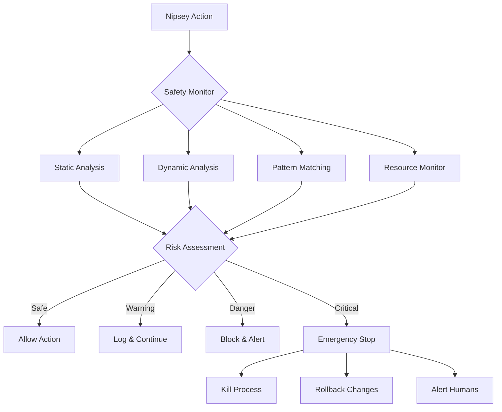

# Nipsey Safety Monitor & Guardian

**Real-time protection system ensuring Nipsey operates safely and within defined boundaries**

## 🛡️ Mission

Provide comprehensive safety monitoring, threat detection, and automatic intervention for Nipsey's autonomous coding activities. This system acts as the guardian angel, preventing any potentially harmful actions while maintaining productivity.

## 🚨 Safety Architecture



## 🔍 Monitoring Layers

### 1. Pre-Execution Safety Checks
```typescript
class PreExecutionSafetyCheck {
  private readonly rules: SafetyRule[] = [
    new FileSafetyRule(),
    new CommandSafetyRule(),
    new NetworkSafetyRule(),
    new ResourceSafetyRule(),
    new CodePatternSafetyRule()
  ];

  async validateAction(action: NipseyAction): Promise<SafetyResult> {
    const results = await Promise.all(
      this.rules.map(rule => rule.validate(action))
    );

    const overallRisk = this.calculateRiskScore(results);
    
    if (overallRisk > 0.8) {
      return {
        allowed: false,
        reason: 'Action exceeds maximum risk threshold',
        riskScore: overallRisk,
        violations: results.filter(r => !r.passed)
      };
    }

    return {
      allowed: true,
      riskScore: overallRisk,
      warnings: results.filter(r => r.warning)
    };
  }

  private calculateRiskScore(results: RuleResult[]): number {
    const weights = {
      critical: 1.0,
      high: 0.7,
      medium: 0.4,
      low: 0.2
    };

    return results.reduce((score, result) => {
      if (!result.passed) {
        return score + weights[result.severity];
      }
      return score;
    }, 0) / results.length;
  }
}
```

### 2. File System Safety Rules
```yaml
file_safety_rules:
  forbidden_paths:
    absolute:
      - "/etc"
      - "/sys"
      - "/boot"
      - "~/.ssh"
      - "~/.aws"
      - "~/.gnupg"
    
    patterns:
      - "*.pem"
      - "*.key"
      - "*.env*"
      - "*secret*"
      - "*password*"
      - "*.wallet"
      - "*.wif"
      
  protected_files:
    - "package-lock.json"
    - "yarn.lock" 
    - "go.sum"
    - ".gitignore"
    - "LICENSE"
    
  size_limits:
    max_file_size: 10MB
    max_total_changes: 50MB
    max_files_modified: 20
    
  operation_limits:
    max_deletions: 5
    max_renames: 10
    forbid_force_operations: true
```

### 3. Command Execution Safety
```typescript
class CommandSafetyAnalyzer {
  private readonly dangerousCommands = new Set([
    'rm -rf',
    'format',
    'dd',
    'chmod 777',
    'curl | bash',
    'wget | sh',
    'npm publish',
    'git push --force',
    'DROP TABLE',
    'DELETE FROM',
    'TRUNCATE'
  ]);

  private readonly dangerousPatterns = [
    /rm\s+.*\*/,           // Wildcard deletion
    />\s*\/dev\/[^n]/,     // Overwriting devices
    /sudo\s+/,             // Elevated privileges
    /kill\s+-9/,           // Force killing processes
    /:(){ :|:& };:/,       // Fork bomb
    /\$\(.*\)/,            // Command substitution
    /`.*`/,                // Backtick execution
  ];

  analyzeCommand(command: string): CommandSafetyResult {
    // Check exact dangerous commands
    for (const dangerous of this.dangerousCommands) {
      if (command.includes(dangerous)) {
        return {
          safe: false,
          reason: `Dangerous command detected: ${dangerous}`,
          severity: 'critical'
        };
      }
    }

    // Check dangerous patterns
    for (const pattern of this.dangerousPatterns) {
      if (pattern.test(command)) {
        return {
          safe: false,
          reason: `Dangerous pattern detected: ${pattern}`,
          severity: 'high'
        };
      }
    }

    // Analyze command complexity
    const complexity = this.calculateComplexity(command);
    if (complexity > 10) {
      return {
        safe: false,
        reason: 'Command too complex for safe execution',
        severity: 'medium'
      };
    }

    return { safe: true, complexity };
  }

  private calculateComplexity(command: string): number {
    const factors = {
      pipes: (command.match(/\|/g) || []).length * 2,
      redirects: (command.match(/[<>]/g) || []).length * 3,
      semicolons: (command.match(/;/g) || []).length * 2,
      ampersands: (command.match(/&/g) || []).length * 4,
      length: command.length / 50
    };

    return Object.values(factors).reduce((a, b) => a + b, 0);
  }
}
```

### 4. Code Pattern Safety Analysis
```typescript
class CodePatternSafetyAnalyzer {
  private readonly dangerousPatterns = {
    // Security vulnerabilities
    sql_injection: /query\s*\(\s*['"`].*\+.*['"`]\s*\)/,
    command_injection: /exec\s*\(\s*['"`].*\+.*['"`]\s*\)/,
    path_traversal: /\.\.\/|\.\.\\/, 
    
    // Crypto/Key exposure
    private_key_exposure: /(?:private[_\s]?key|priv[_\s]?key|secret[_\s]?key)\s*[:=]\s*['"`]/i,
    hardcoded_password: /(?:password|passwd|pwd)\s*[:=]\s*['"`][^'"`]{6,}/i,
    
    // Resource abuse
    infinite_loop: /while\s*\(\s*true\s*\)|for\s*\(\s*;\s*;\s*\)/,
    memory_leak: /setInterval\s*\([^,]+,[^)]+\)(?!.*clearInterval)/,
    
    // Data destruction  
    drop_table: /DROP\s+TABLE/i,
    delete_all: /DELETE\s+FROM\s+\w+\s*(?:;|$)/i,
    truncate: /TRUNCATE\s+TABLE/i
  };

  analyzeCode(code: string, language: string): CodeSafetyResult {
    const violations: SecurityViolation[] = [];

    for (const [name, pattern] of Object.entries(this.dangerousPatterns)) {
      if (pattern.test(code)) {
        violations.push({
          type: name,
          severity: this.getSeverity(name),
          line: this.findLineNumber(code, pattern),
          recommendation: this.getRecommendation(name)
        });
      }
    }

    // Language-specific checks
    const languageViolations = this.checkLanguageSpecific(code, language);
    violations.push(...languageViolations);

    return {
      safe: violations.length === 0,
      violations,
      riskScore: this.calculateRiskScore(violations)
    };
  }

  private checkLanguageSpecific(code: string, language: string): SecurityViolation[] {
    switch (language) {
      case 'javascript':
      case 'typescript':
        return this.checkJavaScriptSafety(code);
      case 'python':
        return this.checkPythonSafety(code);
      case 'go':
        return this.checkGoSafety(code);
      default:
        return [];
    }
  }
}
```

### 5. Resource Monitoring
```typescript
class ResourceMonitor {
  private metrics = {
    cpu: new CpuMonitor(),
    memory: new MemoryMonitor(),
    disk: new DiskMonitor(),
    network: new NetworkMonitor(),
    process: new ProcessMonitor()
  };

  async checkResourceSafety(): Promise<ResourceSafetyResult> {
    const current = await this.getCurrentUsage();
    const limits = this.getResourceLimits();
    const violations: ResourceViolation[] = [];

    // CPU checks
    if (current.cpu > limits.cpu.threshold) {
      violations.push({
        resource: 'cpu',
        current: current.cpu,
        limit: limits.cpu.threshold,
        action: current.cpu > limits.cpu.critical ? 'kill' : 'throttle'
      });
    }

    // Memory checks
    if (current.memory > limits.memory.threshold) {
      violations.push({
        resource: 'memory',
        current: current.memory,
        limit: limits.memory.threshold,
        action: current.memory > limits.memory.critical ? 'kill' : 'warn'
      });
    }

    // Disk I/O checks
    if (current.diskIO > limits.diskIO.threshold) {
      violations.push({
        resource: 'diskIO',
        current: current.diskIO,
        limit: limits.diskIO.threshold,
        action: 'throttle'
      });
    }

    // Network checks
    if (current.network.outbound > limits.network.maxOutbound) {
      violations.push({
        resource: 'network',
        current: current.network.outbound,
        limit: limits.network.maxOutbound,
        action: 'block'
      });
    }

    return {
      safe: violations.length === 0,
      violations,
      recommendation: this.getRecommendation(violations)
    };
  }

  private getResourceLimits() {
    return {
      cpu: { threshold: 50, critical: 80 }, // percentage
      memory: { threshold: 2048, critical: 4096 }, // MB
      diskIO: { threshold: 100, critical: 500 }, // MB/s
      network: { maxOutbound: 10, maxConnections: 50 } // MB/s, count
    };
  }
}
```

## 🚦 Real-Time Intervention System

### Intervention Levels
```yaml
intervention_levels:
  - level: 0
    name: "Monitor"
    action: "Log and continue"
    triggers:
      - Low risk score (<0.2)
      - Informational warnings
    
  - level: 1  
    name: "Warn"
    action: "Alert developer, continue with caution"
    triggers:
      - Medium risk score (0.2-0.5)
      - Non-critical violations
      
  - level: 2
    name: "Pause"
    action: "Pause execution, await confirmation"
    triggers:
      - High risk score (0.5-0.8)
      - Potentially dangerous operations
      
  - level: 3
    name: "Block"
    action: "Block action, rollback if needed"
    triggers:
      - Very high risk score (>0.8)
      - Forbidden operations
      
  - level: 4
    name: "Emergency Stop"
    action: "Kill all processes, full rollback, alert team"
    triggers:
      - Critical security violation
      - System compromise detected
      - Resource exhaustion imminent
```

### Emergency Stop Protocol
```typescript
class EmergencyStopProtocol {
  async execute(reason: string, context: EmergencyContext) {
    console.error('🚨 EMERGENCY STOP INITIATED 🚨');
    
    // Step 1: Kill all Nipsey processes
    await this.killAllProcesses();
    
    // Step 2: Pause Docker containers
    await this.pauseContainers();
    
    // Step 3: Git rollback
    await this.rollbackChanges(context.lastSafeCommit);
    
    // Step 4: Alert all channels
    await this.alertTeam({
      severity: 'CRITICAL',
      reason,
      context,
      timestamp: new Date(),
      actions: ['All processes killed', 'Changes rolled back']
    });
    
    // Step 5: Generate incident report
    await this.generateIncidentReport(reason, context);
    
    // Step 6: Lock system until manual review
    await this.lockSystem();
  }

  private async alertTeam(alert: EmergencyAlert) {
    const channels = [
      this.sendSlackAlert,
      this.sendEmailAlert,
      this.sendSMSAlert,
      this.createGitHubIssue,
      this.triggerPagerDuty
    ];

    await Promise.all(channels.map(ch => ch(alert)));
  }
}
```

## 📊 Safety Metrics & Reporting

### Real-Time Dashboard
```typescript
interface SafetyDashboard {
  current: {
    status: 'safe' | 'warning' | 'danger' | 'stopped';
    activeTask: string | null;
    riskScore: number;
    uptime: number;
    interventions: number;
  };
  
  history: {
    last24h: {
      tasksCompleted: number;
      tasksBlocked: number;
      warnings: number;
      emergencyStops: number;
    };
  };
  
  resources: {
    cpu: number;
    memory: number;
    disk: number;
    network: number;
  };
  
  violations: ViolationLog[];
}

class SafetyReporter {
  generateDailyReport(): SafetyReport {
    return {
      summary: {
        date: new Date(),
        totalTasks: this.metrics.totalTasks,
        safetyScore: this.calculateSafetyScore(),
        incidents: this.metrics.incidents
      },
      
      topRisks: this.identifyTopRisks(),
      
      recommendations: [
        'Update forbidden patterns based on new violations',
        'Adjust resource limits for better performance',
        'Review blocked actions for false positives'
      ],
      
      learnings: this.extractLearnings()
    };
  }
}
```

### Safety Configuration
```javascript
// nipsey-safety.config.js
module.exports = {
  monitoring: {
    enabled: true,
    level: 'paranoid', // 'relaxed' | 'normal' | 'strict' | 'paranoid'
    
    checkInterval: 1000, // ms
    
    alerts: {
      slack: process.env.SLACK_WEBHOOK,
      email: process.env.ALERT_EMAIL,
      sms: process.env.ALERT_PHONE
    }
  },
  
  limits: {
    file: {
      maxSize: 10 * 1024 * 1024, // 10MB
      maxFiles: 20,
      forbiddenPaths: ['/etc', '~/.ssh', '*.key']
    },
    
    command: {
      maxComplexity: 10,
      timeout: 30000, // 30s
      forbidden: ['rm -rf', 'sudo', 'DROP TABLE']
    },
    
    resource: {
      maxCpu: 50,
      maxMemory: 2048,
      maxDiskIO: 100,
      maxNetwork: 10
    }
  },
  
  interventions: {
    autoRollback: true,
    requireConfirmation: ['delete', 'modify_config', 'publish'],
    blockAfterWarnings: 3,
    emergencyStopTriggers: ['private_key', 'rm -rf /', 'infinite_loop']
  }
};
```

## 🔐 Security Integration

### Audit Trail
```sql
CREATE TABLE nipsey_audit_log (
  id SERIAL PRIMARY KEY,
  timestamp TIMESTAMP DEFAULT NOW(),
  action_type VARCHAR(100),
  risk_score DECIMAL(3,2),
  allowed BOOLEAN,
  intervention_level INTEGER,
  reason TEXT,
  file_changes JSONB,
  command_executed TEXT,
  resource_usage JSONB,
  safety_violations JSONB,
  session_id UUID,
  task_id UUID
);

-- Index for quick security reviews
CREATE INDEX idx_audit_violations ON nipsey_audit_log(allowed, risk_score);
CREATE INDEX idx_audit_time ON nipsey_audit_log(timestamp);
```

---

**This safety monitor ensures Nipsey remains a helpful assistant, not a harmful automaton. Every action is validated, monitored, and can be instantly stopped if anything seems amiss.**