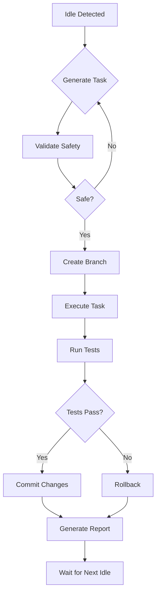

# Nipsey Idle-Time Task Generator

**Intelligent task generation for autonomous AI coding during developer idle time**

## 🎯 Mission

Generate safe, valuable, and contextually appropriate tasks for Nipsey to work on while developers are idle. Following _unwriter's "ready-made" philosophy - tasks should be immediately valuable without requiring AI/blockchain education.

## 🧠 Task Generation Philosophy

### Core Principles
1. **Safety First**: Never modify critical code without review
2. **Incremental Value**: Small, reversible improvements
3. **Context Aware**: Tasks based on recent developer activity
4. **Test-Driven**: Prioritize test fixes and coverage
5. **Documentation**: Keep humans in the loop with clear reports

### Task Priority Hierarchy
```
1. 🔴 Failing Tests (Fix immediately)
2. 🟡 TODOs in Recent Files (Context-aware tasks)  
3. 🟢 Code Quality (Safe improvements)
4. 🔵 Documentation (Always safe)
5. ⚪ Research Tasks (Non-modifying exploration)
```

## 📋 Task Categories

### 1. Test Fixing Tasks
```yaml
category: test_fixing
priority: critical
safety: high
tasks:
  - id: fix_failing_unit_tests
    description: "Fix failing unit tests in the test suite"
    detection:
      - Run test suite and identify failures
      - Analyze error messages and stack traces
      - Check recent commits for breaking changes
    execution:
      - Create branch: nipsey/fix-tests-{timestamp}
      - Analyze test failure patterns
      - Implement minimal fixes
      - Verify all tests pass
      - Commit with detailed explanation
    constraints:
      - Only modify test files unless fixing obvious typos
      - Maximum 5 test fixes per session
      - Must maintain existing test intent

  - id: increase_test_coverage
    description: "Add tests for uncovered code paths"
    detection:
      - Run coverage report
      - Identify files with < 80% coverage
      - Prioritize recently modified files
    execution:
      - Target specific uncovered functions
      - Write comprehensive test cases
      - Ensure tests are meaningful, not just coverage
    constraints:
      - Only add tests, never modify source code
      - Focus on business logic, not boilerplate
```

### 2. TODO Resolution Tasks
```yaml
category: todo_resolution
priority: high
safety: medium
tasks:
  - id: implement_todos_in_recent_files
    description: "Complete TODO comments in recently modified files"
    detection:
      - Git log for files modified in last 7 days
      - Grep for TODO, FIXME, HACK comments
      - Prioritize by author and recency
    execution:
      - Create branch: nipsey/todo-{feature}-{timestamp}
      - Implement TODO with context awareness
      - Add tests for new functionality
      - Update or remove TODO comment
    constraints:
      - Maximum 3 TODOs per session
      - Skip TODOs marked with "HUMAN:" prefix
      - Must understand surrounding code context

  - id: upgrade_deprecated_patterns
    description: "Update deprecated API usage"
    detection:
      - Search for @deprecated annotations
      - Check for outdated library patterns
      - Analyze npm/go deprecation warnings
    execution:
      - Research migration path
      - Update to modern patterns
      - Ensure backward compatibility
```

### 3. Code Quality Tasks
```yaml
category: code_quality
priority: medium
safety: high
tasks:
  - id: extract_duplicate_code
    description: "Identify and extract duplicate code into utilities"
    detection:
      - Use AST analysis for similar code blocks
      - Minimum 10 lines of duplication
      - Occurs in 3+ locations
    execution:
      - Create shared utility function
      - Replace duplicates with utility calls
      - Add comprehensive tests for utility
    constraints:
      - Preserve exact functionality
      - Maintain all edge cases
      - Clear naming conventions

  - id: improve_error_handling
    description: "Add proper error handling to try-catch blocks"
    detection:
      - Find empty catch blocks
      - Identify missing error logging
      - Check for swallowed errors
    execution:
      - Add appropriate error logging
      - Implement proper error recovery
      - Add error tests
    constraints:
      - Never change business logic
      - Maintain existing error behavior
      - Use project's logging patterns
```

### 4. Documentation Tasks
```yaml
category: documentation
priority: low
safety: maximum
tasks:
  - id: generate_missing_jsdoc
    description: "Add JSDoc comments to undocumented functions"
    detection:
      - Find public functions without JSDoc
      - Prioritize exported functions
      - Check complexity for priority
    execution:
      - Analyze function signature and body
      - Generate comprehensive JSDoc
      - Include parameter types and examples
    constraints:
      - Never modify code
      - Be accurate about functionality
      - Follow project documentation style

  - id: update_readme_sections
    description: "Keep README files up to date"
    detection:
      - Compare README with actual project state
      - Check for outdated commands
      - Verify installation instructions
    execution:
      - Update commands to match package.json
      - Refresh dependency lists
      - Update feature lists
```

### 5. Research & Analysis Tasks
```yaml
category: research
priority: low
safety: maximum
tasks:
  - id: dependency_security_audit
    description: "Check for security vulnerabilities"
    detection:
      - Run npm audit / go mod audit
      - Check CVE databases
      - Analyze dependency tree
    execution:
      - Generate security report
      - Research fix strategies
      - Create upgrade plan (not executed)
    output:
      - NIPSEY_SECURITY_REPORT.md
      - Proposed fixes for human review

  - id: performance_bottleneck_analysis
    description: "Identify potential performance issues"
    detection:
      - Analyze computational complexity
      - Check for N+1 queries
      - Profile resource usage
    execution:
      - Generate performance report
      - Suggest optimizations
      - Create benchmarks
    output:
      - NIPSEY_PERFORMANCE_REPORT.md
      - Benchmark suite for validation
```

## 🤖 Task Selection Algorithm

```typescript
interface TaskContext {
  recentFiles: string[];        // Files modified in last session
  failingTests: TestResult[];   // Current test failures
  idleMinutes: number;          // How long user has been idle
  lastTasks: CompletedTask[];   // Avoid repetition
  projectState: ProjectHealth;   // Overall project metrics
}

class NipseyTaskSelector {
  selectNextTask(context: TaskContext): Task {
    // Priority 1: Failing tests
    if (context.failingTests.length > 0) {
      return this.generateTestFixTask(context.failingTests[0]);
    }
    
    // Priority 2: TODOs in recent files
    const recentTodos = this.findTodosInFiles(context.recentFiles);
    if (recentTodos.length > 0 && context.idleMinutes > 30) {
      return this.generateTodoTask(recentTodos[0]);
    }
    
    // Priority 3: Code quality in recent files
    if (context.idleMinutes > 45) {
      const qualityIssues = this.analyzeCodeQuality(context.recentFiles);
      if (qualityIssues.length > 0) {
        return this.generateQualityTask(qualityIssues[0]);
      }
    }
    
    // Priority 4: Documentation
    if (context.idleMinutes > 60) {
      const undocumented = this.findUndocumentedCode();
      if (undocumented.length > 0) {
        return this.generateDocTask(undocumented[0]);
      }
    }
    
    // Priority 5: Research tasks
    return this.generateResearchTask(context.projectState);
  }
  
  // Safety constraints
  private isTaskSafe(task: Task): boolean {
    return (
      task.maxFilesModified <= 10 &&
      task.estimatedTime <= 45 &&
      task.requiresHumanReview === false &&
      !task.modifiesCriticalPaths
    );
  }
}
```

## 🛡️ Safety Mechanisms

### Pre-Task Validation
```typescript
class TaskSafetyValidator {
  async validateTask(task: Task): Promise<ValidationResult> {
    const checks = [
      this.checkGitStatus(),        // Clean working directory
      this.checkBranchProtection(), // Not on main/master
      this.checkFilePermissions(),  // Can modify target files
      this.checkTestSuite(),        // Tests currently passing
      this.checkDiskSpace(),        // Sufficient space
      this.checkRateLimit()         // Not too many tasks
    ];
    
    const results = await Promise.all(checks);
    return {
      safe: results.every(r => r.safe),
      warnings: results.flatMap(r => r.warnings),
      blockers: results.flatMap(r => r.blockers)
    };
  }
}
```

### Task Execution Sandbox
```yaml
sandbox_constraints:
  - branch_prefix: "nipsey/"
  - max_files_changed: 10
  - max_lines_changed: 500
  - forbidden_files:
    - "*.env*"
    - "*.key"
    - "*.pem"
    - "config/production.json"
    - "package-lock.json" 
  - forbidden_operations:
    - "git push --force"
    - "npm publish"
    - "rm -rf"
    - "DROP TABLE"
  - time_limit: 45_minutes
  - checkpoint_interval: 15_minutes
```

## 📊 Task Success Metrics

```typescript
interface TaskMetrics {
  // Immediate metrics
  testsFixed: number;
  todosResolved: number;
  coverageIncrease: number;
  linesDocumented: number;
  
  // Quality metrics
  codeComplexityReduction: number;
  duplicateCodeRemoved: number;
  errorHandlingImproved: number;
  
  // Developer metrics
  humanApprovalRate: number;
  taskCompletionRate: number;
  averageTaskTime: number;
  rollbackRate: number;
}

class TaskSuccessTracker {
  evaluateSession(tasks: CompletedTask[]): SessionReport {
    return {
      summary: this.generateSummary(tasks),
      metrics: this.calculateMetrics(tasks),
      learnings: this.extractLearnings(tasks),
      recommendations: this.generateRecommendations(tasks)
    };
  }
}
```

## 🔄 Continuous Learning

### Task Pattern Learning
```yaml
learning_system:
  successful_patterns:
    - Task type → Success rate
    - File patterns → Task appropriateness  
    - Time of day → Task complexity
    - Developer activity → Task relevance
    
  failure_patterns:
    - Rejected PRs → Reason analysis
    - Reverted commits → Pattern detection
    - Failed tasks → Root cause analysis
    
  optimization:
    - Adjust task selection weights
    - Refine safety constraints
    - Improve context detection
    - Enhance code understanding
```

## 🚀 Integration with Nipsey

### Task Queue Configuration
```javascript
// nipsey.config.js
module.exports = {
  tasks: {
    generator: 'nipsey-task-generator',
    priorities: {
      test_fixes: 1.0,
      todos: 0.8,
      code_quality: 0.6,
      documentation: 0.4,
      research: 0.2
    },
    
    constraints: {
      maxTasksPerSession: 5,
      maxTimePerTask: 45,
      requireCleanGit: true,
      requirePassingTests: false, // Can fix failing tests
      branchPrefix: 'nipsey/'
    },
    
    schedule: {
      idleThreshold: 15, // minutes
      maxSessionLength: 180, // minutes
      checkpointInterval: 15, // minutes
      cooldownPeriod: 30 // minutes between sessions
    }
  }
};
```

### Task Execution Flow


---

**This task generator ensures Nipsey works on valuable, safe tasks that genuinely help developers while they're away, following the "ready-made" philosophy of immediate utility without requiring education.**