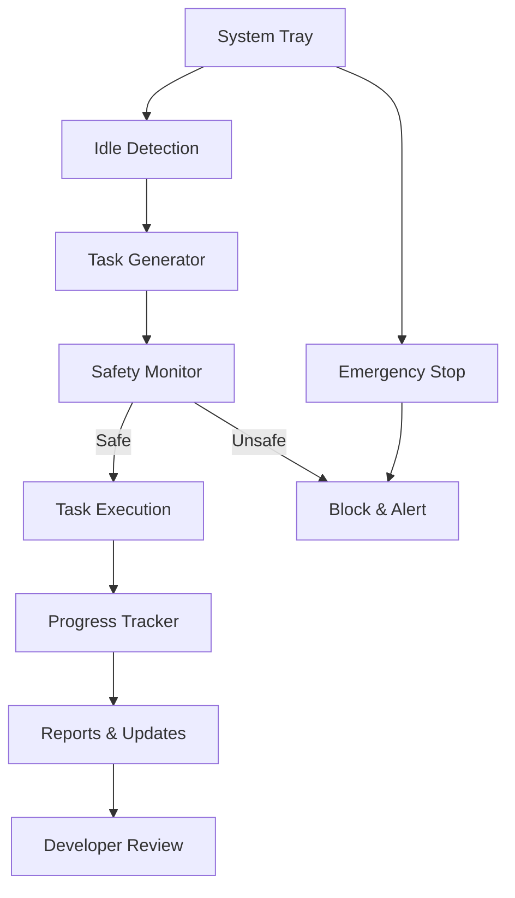

# Nipsey Complete Integration Guide

**Transform the three Nipsey prompts into a working autonomous AI coding assistant**

## 🎯 Overview

This guide walks you through integrating:
1. **Task Generator** - Intelligent task selection
2. **Safety Monitor** - Real-time protection
3. **Progress Tracker** - Visibility and reporting

Into a cohesive system that works while you're idle.

## 🏗️ System Architecture



## 📦 Step 1: Core Nipsey Setup

### 1.1 Clone and Build Nipsey
```bash
# Clone the repository
git clone https://github.com/yourusername/nipsey.git
cd nipsey

# Install dependencies
go mod download

# Build with system tray support
CGO_ENABLED=1 go build -o nipsey main.go

# Verify build
./nipsey --version
```

### 1.2 Initial Configuration
```bash
# Create config directory
mkdir -p ~/.nipsey/config

# Generate default configuration
./nipsey init

# This creates:
# ~/.nipsey/config/nipsey.yaml
# ~/.nipsey/config/safety-rules.yaml
# ~/.nipsey/config/task-templates.yaml
```

### 1.3 Edit Main Configuration
```yaml
# ~/.nipsey/config/nipsey.yaml
nipsey:
  version: 1.0.0
  mode: "cautious" # cautious | normal | aggressive
  
  idle:
    threshold: 15 # minutes before starting
    check_interval: 30 # seconds
    
  api:
    anthropic:
      api_key: "${ANTHROPIC_API_KEY}"
      model: "claude-3-opus-20240229"
    
  github:
    token: "${GITHUB_TOKEN}"
    default_branch: "main"
    pr_prefix: "nipsey/"
    
  notifications:
    slack:
      webhook: "${SLACK_WEBHOOK}"
      channel: "#nipsey-updates"
    email:
      smtp_host: "smtp.gmail.com"
      smtp_port: 587
      from: "nipsey@yourdomain.com"
      to: ["dev@yourdomain.com"]
```

## 🧠 Step 2: Integrate Task Generator

### 2.1 Configure Task Sources
```yaml
# ~/.nipsey/config/task-templates.yaml
task_sources:
  - type: "failing_tests"
    priority: 1.0
    enabled: true
    config:
      test_commands:
        - "npm test"
        - "go test ./..."
        - "pytest"
      
  - type: "todos"
    priority: 0.8
    enabled: true
    config:
      patterns:
        - "TODO:"
        - "FIXME:"
        - "HACK:"
      exclude_patterns:
        - "TODO(human):"
        - "FIXME(later):"
      
  - type: "code_quality"
    priority: 0.6
    enabled: true
    config:
      linters:
        - "eslint"
        - "golangci-lint"
        - "ruff"
```

### 2.2 Implement Task Generator Integration
```go
// nipsey/tasks/generator.go
package tasks

import (
    "github.com/nipsey/core"
    "github.com/nipsey/prompts"
)

type TaskGenerator struct {
    config   *core.Config
    prompter *prompts.Client
}

func (tg *TaskGenerator) GenerateNextTask(context *TaskContext) (*Task, error) {
    // Load the task generator prompt
    prompt, err := prompts.Load("nipsey-task-generator.md")
    if err != nil {
        return nil, err
    }
    
    // Prepare context for the prompt
    promptContext := map[string]interface{}{
        "recent_files":   context.RecentFiles,
        "failing_tests":  context.FailingTests,
        "idle_minutes":   context.IdleMinutes,
        "project_state":  context.ProjectState,
    }
    
    // Execute prompt with Claude
    response, err := tg.prompter.Execute(prompt, promptContext)
    if err != nil {
        return nil, err
    }
    
    // Parse task from response
    task := tg.parseTaskResponse(response)
    
    return task, nil
}
```

## 🛡️ Step 3: Integrate Safety Monitor

### 3.1 Configure Safety Rules
```yaml
# ~/.nipsey/config/safety-rules.yaml
safety:
  file_system:
    forbidden_paths:
      - "/etc"
      - "/System"
      - "~/.ssh"
      - "**/*.pem"
      - "**/*.key"
      - "**/.env*"
    
    max_changes:
      files: 20
      size_mb: 10
      
  commands:
    forbidden:
      - "rm -rf"
      - "sudo"
      - "chmod 777"
      - "DROP TABLE"
      
    require_confirmation:
      - "npm publish"
      - "git push"
      - "deploy"
      
  resources:
    limits:
      cpu_percent: 50
      memory_mb: 2048
      disk_io_mbps: 100
      
  code_patterns:
    security_violations:
      - pattern: "private.*key.*=.*['\"]"
        severity: "critical"
      - pattern: "password.*=.*['\"]"
        severity: "high"
```

### 3.2 Implement Safety Monitor
```go
// nipsey/safety/monitor.go
package safety

type SafetyMonitor struct {
    rules    *SafetyRules
    alerter  *AlertSystem
    stopper  *EmergencyStop
}

func (sm *SafetyMonitor) ValidateAction(action *Action) (*SafetyResult, error) {
    results := []RuleResult{}
    
    // Check all safety rules
    for _, rule := range sm.rules.All() {
        result := rule.Validate(action)
        results = append(results, result)
        
        // Immediate stop for critical violations
        if result.Severity == "critical" {
            sm.stopper.Execute(result.Reason)
            return &SafetyResult{
                Allowed: false,
                Reason:  result.Reason,
                Action:  "emergency_stop",
            }, nil
        }
    }
    
    // Calculate overall safety
    overallSafety := sm.calculateSafety(results)
    
    if overallSafety.RiskScore > 0.8 {
        sm.alerter.SendAlert(AlertLevelHigh, overallSafety)
        return &SafetyResult{
            Allowed: false,
            Reason:  "Risk score too high",
        }, nil
    }
    
    return overallSafety, nil
}

// Real-time monitoring goroutine
func (sm *SafetyMonitor) StartMonitoring() {
    go func() {
        ticker := time.NewTicker(1 * time.Second)
        for range ticker.C {
            metrics := sm.collectSystemMetrics()
            
            if sm.isSystemAtRisk(metrics) {
                sm.handleSystemRisk(metrics)
            }
        }
    }()
}
```

## 📊 Step 4: Integrate Progress Tracker

### 3.1 Configure Reporting
```yaml
# ~/.nipsey/config/reports.yaml
reporting:
  realtime:
    enabled: true
    terminal: true
    slack: true
    dashboard_port: 8765
    
  session_summary:
    generate_on_complete: true
    create_pr: true
    send_slack: true
    
  analytics:
    weekly_report: true
    metrics_retention_days: 90
    
  formats:
    - markdown
    - html
    - json
```

### 4.2 Implement Progress Tracking
```go
// nipsey/progress/tracker.go
package progress

type ProgressTracker struct {
    metrics   *MetricsCollector
    reporter  *MultiChannelReporter
    analytics *AnalyticsEngine
}

func (pt *ProgressTracker) TrackTask(task *Task) {
    pt.metrics.StartTask(task)
    
    // Real-time updates
    go pt.sendRealtimeUpdates(task)
}

func (pt *ProgressTracker) CompleteTask(task *Task, result *TaskResult) {
    pt.metrics.CompleteTask(task, result)
    
    // Generate immediate summary
    summary := pt.generateTaskSummary(task, result)
    pt.reporter.BroadcastUpdate(summary)
    
    // Check for session milestones
    if pt.metrics.IsSessionMilestone() {
        pt.generateMilestoneReport()
    }
}

func (pt *ProgressTracker) GenerateSessionReport(session *Session) {
    report := &SessionReport{
        Summary:        pt.generateExecutiveSummary(session),
        Metrics:        pt.metrics.GetSessionMetrics(),
        Visualizations: pt.generateCharts(session),
        Tasks:          pt.getDetailedTaskList(session),
    }
    
    // Multi-channel delivery
    pt.reporter.DeliverReport(report, []string{
        "slack",
        "github_pr", 
        "email",
        "dashboard",
    })
}
```

## 🚀 Step 5: Complete System Integration

### 5.1 Main Application Loop
```go
// nipsey/main.go
package main

import (
    "github.com/nipsey/tasks"
    "github.com/nipsey/safety"
    "github.com/nipsey/progress"
    "github.com/nipsey/idle"
)

func main() {
    // Initialize components
    config := LoadConfig()
    taskGen := tasks.NewGenerator(config)
    safetyMon := safety.NewMonitor(config)
    progressTrack := progress.NewTracker(config)
    
    // Setup system tray
    systray.Run(onReady, onExit)
}

func onReady() {
    // System tray setup
    systray.SetIcon(icon.Data)
    systray.SetTitle("Nipsey")
    systray.SetTooltip("AI Coding Assistant")
    
    // Add menu items
    mStatus := systray.AddMenuItem("Status: Idle", "")
    mPause := systray.AddMenuItem("Pause", "")
    systray.AddSeparator()
    mQuit := systray.AddMenuItem("Quit", "")
    
    // Start idle detection
    go runNipsey()
    
    // Handle menu clicks
    for {
        select {
        case <-mPause.ClickedCh:
            togglePause()
        case <-mQuit.ClickedCh:
            systray.Quit()
        }
    }
}

func runNipsey() {
    idleDetector := idle.NewDetector()
    
    for {
        if idleDetector.IsIdle() && !isPaused() {
            session := startSession()
            
            for idleDetector.IsIdle() && !session.IsComplete() {
                // Generate task
                task, err := taskGenerator.GenerateNextTask(session.Context())
                if err != nil {
                    log.Error("Task generation failed:", err)
                    continue
                }
                
                // Safety check
                safetyResult, err := safetyMonitor.ValidateTask(task)
                if !safetyResult.Allowed {
                    progressTracker.TrackBlockedTask(task, safetyResult)
                    continue
                }
                
                // Execute task
                progressTracker.StartTask(task)
                result := executeTask(task)
                progressTracker.CompleteTask(task, result)
                
                // Check session limits
                if session.ShouldEnd() {
                    break
                }
            }
            
            // Generate session report
            progressTracker.GenerateSessionReport(session)
        }
        
        time.Sleep(30 * time.Second)
    }
}
```

### 5.2 Docker Compose Setup
```yaml
# docker-compose.yml
version: '3.8'

services:
  nipsey:
    build: .
    environment:
      - ANTHROPIC_API_KEY=${ANTHROPIC_API_KEY}
      - GITHUB_TOKEN=${GITHUB_TOKEN}
      - DISPLAY=${DISPLAY}
    volumes:
      - ~/code:/workspace
      - ~/.nipsey:/root/.nipsey
      - /var/run/docker.sock:/var/run/docker.sock
    network_mode: host
    privileged: true
    
  dashboard:
    image: nipsey-dashboard
    ports:
      - "8765:8765"
    environment:
      - NIPSEY_API=http://nipsey:8080
      
  redis:
    image: redis:alpine
    ports:
      - "6379:6379"
```

## 🎮 Step 6: Usage & Control

### 6.1 Starting Nipsey
```bash
# Start in foreground (for testing)
./nipsey run

# Start as background service
./nipsey start

# Check status
./nipsey status
```

### 6.2 Emergency Controls
- **System Tray**: Click to pause/resume
- **Hotkey**: `Cmd+Option+Escape` for emergency stop
- **Terminal**: `nipsey stop` to halt all operations
- **Kill Switch**: `pkill -9 nipsey` (last resort)

### 6.3 Monitoring
```bash
# View real-time logs
nipsey logs -f

# Check current task
nipsey status --current

# View session metrics
nipsey metrics --session

# Generate report
nipsey report --last-session
```

## 📊 Step 7: Verification & Testing

### 7.1 Test Safety Systems
```bash
# Run safety test suite
nipsey test safety

# Simulate dangerous operations
nipsey test safety --simulate-dangerous

# Verify emergency stop
nipsey test emergency-stop
```

### 7.2 Test Task Generation
```bash
# Generate sample tasks without execution
nipsey test tasks --dry-run

# Test specific task types
nipsey test tasks --type=test_fixes
```

### 7.3 Test Progress Tracking
```bash
# Generate sample report
nipsey test report --sample

# Test notification channels
nipsey test notifications
```

## 🎯 Configuration Best Practices

1. **Start Cautious**: Begin with `mode: cautious` and gradually increase
2. **Whitelist Projects**: Only allow Nipsey in specific directories initially
3. **Test Notifications**: Ensure all alert channels work before going live
4. **Monitor Resources**: Set conservative resource limits initially
5. **Review Reports**: Manually review first few sessions thoroughly

## 🚨 Troubleshooting

### Common Issues

1. **"Cannot detect idle"**
   - Check idle detection permissions
   - Verify CGO_ENABLED=1 during build

2. **"Safety monitor blocking everything"**
   - Review safety rules, may be too strict
   - Check file path patterns

3. **"No tasks generated"**
   - Verify test commands are correct
   - Check if TODOs exist in codebase

4. **"Progress not updating"**
   - Check Slack webhook URL
   - Verify dashboard port is open

---

**With this integration complete, Nipsey becomes your tireless AI teammate - working safely and productively while you rest, always ready with a detailed report of accomplishments when you return.**