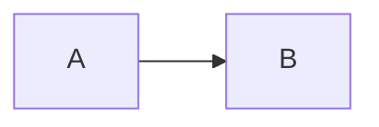

# Markdown Writer Reference

## Renderer notes
- Advanced features are renderer-specific. If the target is unknown, default to GitHub Flavored Markdown (GFM) and flag any non-standard features.
- Prefer Markdown over HTML; use HTML only for features Markdown cannot express.

## Advanced patterns and snippets

### Callouts (GitHub)
```md
> [!NOTE]
> This is a callout.
```

### Collapsible sections (HTML, widely supported)
```md
<details>
  <summary>Show details</summary>

  Hidden content goes here.
</details>
```

### Task lists (GFM)
```md
- [ ] Write the draft
- [x] Review edits
```

### Tables with alignment
```md
| Column | Left | Center | Right |
|:------|:-----|:------:|------:|
| Row 1 | a    | b      | c     |
```

### Mermaid diagrams (GFM)
````md

````

### Footnotes (GFM)
```md
Here is a footnote.[^1]

[^1]: Footnote text.
```

### Anchored links to headings
```md
[Jump to usage](#usage)
```

### Diff fences for change examples
````md
```diff
- old line
+ new line
```
````

### Images with sizing (HTML)
```md

```

### Inline HTML helpers
```md
Press <kbd>Cmd</kbd> + <kbd>K</kbd> to open the palette.
Water is H<sub>2</sub>O and 2<sup>3</sup> = 8.
```

### Reference-style links
```md
[Link text][ref]

[ref]: https://example.com
```

### Escaping backticks in inline code
```md
Use `` `code` `` to show backticks in inline code.
```
